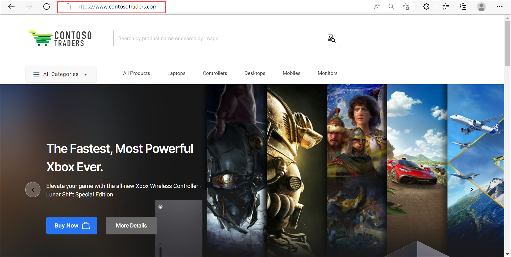

# Cloud Native App Architecture Walkthrough : L100

## Overview

Contoso Traders is one of the leading E-Commerce platforms with a wide range of electronic products like desktops and laptops, mobile phones, gaming console accessories, and monitors. This includes a wide range of international brands like Microsoft Surface, XBOX, Samsung, ASUS, DELL etc. Contoso Traders Organization is using Microsoft 365 for their collaboration works internally.

Contoso Traders has different departments like marketing, sales, accounts, HR, and IT. For internal communication, they are using Microsoft Teams and Outlook. In the Contoso Traders organisation, there are various functionalities with the Contoso Traders E-commerce platform like product approval, product price approval, Product price update approval etc. 

## Context

You will explore the Contoso traders code base present in a GitHub repository which contains all the files related to the application’s UI, backend APIs, deployment files, GitHub workflows, and deployment guides. You will also launch the application and review the functionalities of it.

## Solution Architecture

Contoso Traders is a 2 tier application and consists of Client tier.

Presentation tier conatins the React JS application that acts as a client, collects the the information given by the user and passes it to Database tier. It consists of a collection of small, autonomous services. Each service is self-contained and should implement a single business capability within a bounded context. A bounded context is a natural division within a business and provides an explicit boundary within which a domain model exists.

## Major components of Solution Architecture:

### DEVOPS

The word DevOps is a combination of the terms development and operations, meant to represent a collaborative or shared approach to the tasks performed by a company's application development and IT operations teams.

DEVOPS consists of 2 components:

1. **GitHub (Reposistry and Actions)**: A code hosting platform for version control and collaboration.

   - **GitHub Repository**: A repository contains all of your project's files and each file's revision history. You can discuss and manage your project's work within the repository. You can find the **ContosoTraders** Application's GitHub repository here `https://github.com/microsoft/ContosoTraders`.
   - **GitHub Actions**: A continuous integration and continuous delivery (CI/CD) platform that allows you to automate your build, test, and deployment pipeline. In this application you are deploying Azure Infrastructure using the Bicep template with the GitHub Workflow.

2. **Container Registry**: Allows you to build, store, and manage container images and artifacts in a private registry for all types of container deployments.   

### MICROSERVICES

Microservices are a popular architectural style for building applications that are resilient, highly scalable, independently deployable, and able to evolve quickly. It consists of a collection of small, autonomous services. Each service is self-contained and should implement a single business capability within a bounded context. A bounded context is a natural division within a business and provides an explicit boundary within which a domain model exists.

Backend tier consists of 3 API components that are containerized:

1. **Shopping Cart**: Azure Container App is fully managed serverless container service for building and deploying modern apps at scale which helps in deploying containerised apps without managing complex infrastructure. Azure Cosmos DB is a fully managed NoSQL and relational database for modern app development. Cosmos DB holds the data of products which you add to the shopping cart.

2. **Products and Stocks/Inventory**: Azure Kubernetes service simplifies deploying a managed Kubernetes cluster in Azure by offloading the operational overhead to Azure. Controller commands, Service layer repositories and Data Model encapsulated in AKS. Azure SQL Database is an always-up-to-date, fully managed relational database service built for the cloud. Build your next app with the simplicity and flexibility of a multi-model database that scales to meet demand. It offers single-digit millisecond response times, automatic and instant scalability, along with guarantee speed at any scale.

3. **Image Search**: An image search engine is a tool that helps you find appropriate images to use in your online store. The Computer Vision service provides developers with access to advanced algorithms for processing images and returning the product information that are stored in the storage account. The storage account provides a unique namespace which provides highly available, durable, scalable and redundant storage. Here, in this application storage accounts stores the images of the products available in the application, which can be accessed by computer vision and app service.

### Gateway & IAM

Application Gateway is a web traffic load balancer that enables you to manage traffic to your web applications. IAM is a cloud service that controls the permissions and access for users and cloud resources.

1. **Azure Active Directory**: Azure AD is an integrated cloud identity and access solution, and a leader in the market for managing directories, enabling access to applications, and protecting identities.

2. **API Managemnet (Gateway)**: Azure API Management offers a scalable, multi-cloud API management platform for securing, publishing and analysing APIs.

### Front End

The Front End is the part of the website where users can see and interact with such as the graphical user interface (GUI) and the command line including the design, navigating menus, texts, images, videos, etc.

The primary use of a CDN is to decrease load times across a geographical area and DNS plays a major part in this. In order to make use of a CDN, the domain must point to a CDN provider. There are two App Service's in the application, one created with React JS is used as main website for ContosoTraders and other created using C#/ASP.Net for Rewards App. Power Apps is used to create the Shipping Management App where this app will be managing shipment. Storage Account is used to store the images of the products available in the application. 

## Instructions

1. Open browser, using a new tab navigate to `https://github.com/microsoft/ContosoTraders` GitHub repository. This repository conatins all the neccessary files and documents which will guide you to host the contoso traders application from the scratch.

1. Navigate to github/workflows folder, it contains the workflow YAML files using which you can the deployment resources. Please see the individual workflows for more information.

1. contoso-traders-infra-deployment.yml will deploy the infrastructure into Azure which includes resource groups, resources, sets access policies to key vaults, and seeds the database from storage accounts into an Azure SQL database. This workflow will invoke the Bicep template that deploys the ACI app and AKS cluster.

1. contoso-traders-app-deployment.yml deploys the application to Azure cloud. The application is configured to use the pre-deployed resources.

1. contoso-traders-load-testing.yml configures the load testing for the application.

## Launch App

1. Open browser and navigate to [https://contosotraders.com/](https://www.contosotraders.com/)

   
   
   In the webpage you will be able to see the ecommerce store with clsuter of electronic products such as Laptops, Xbox controllers, Desktops, mobile phones and monitors of different brands.

## Summary

You have got an overview of the ContosoTraders Application and also walkthrough of the App Architecture.
