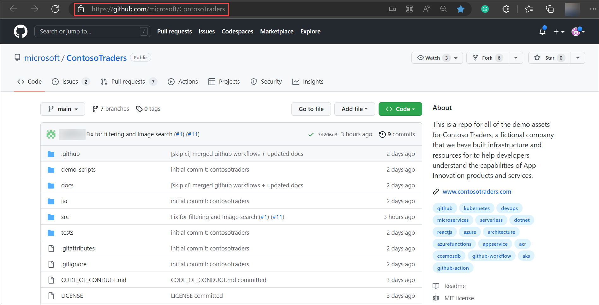
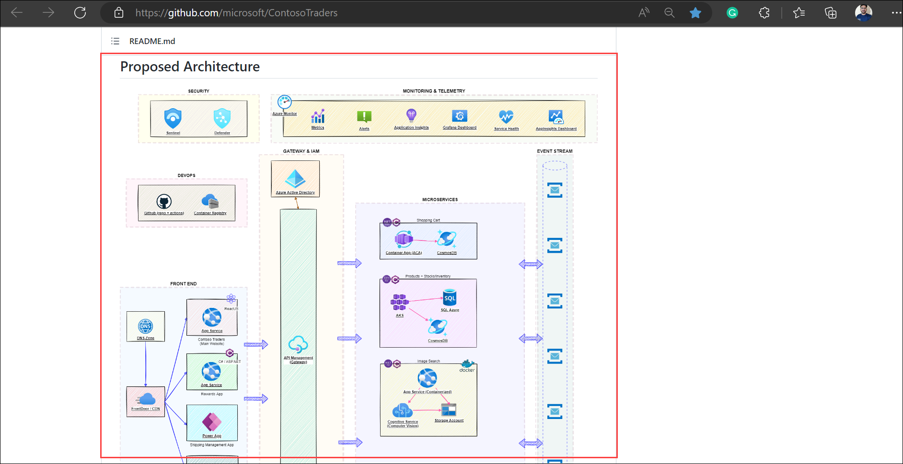
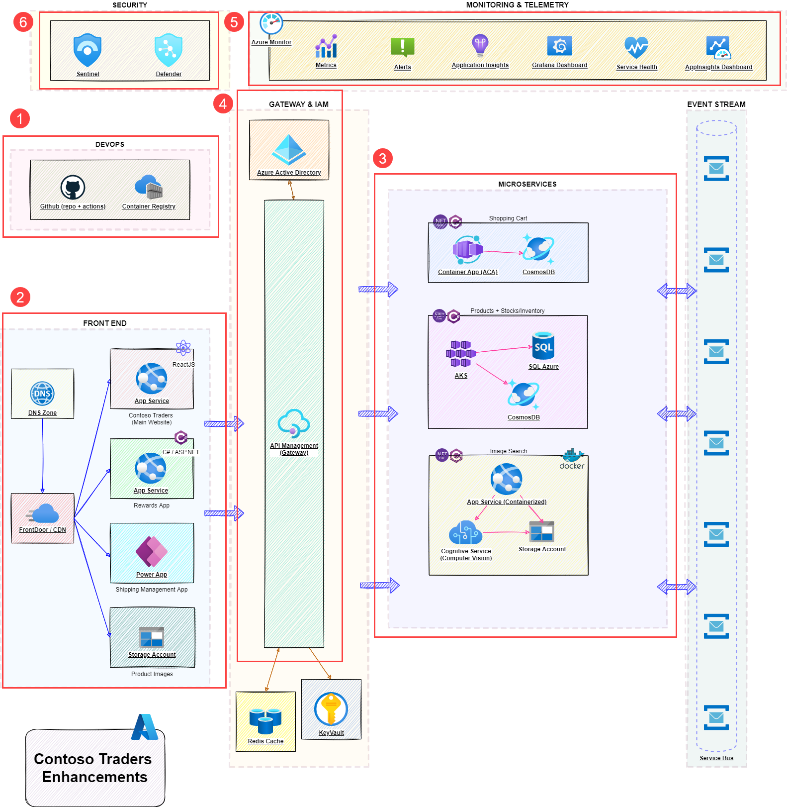

# Technical Walkthrough: Cloud Native Infrastructure

## Overview

Contoso Traders is one of the leading E-Commerce platforms with a wide range of electronic products like desktops and laptops, mobile phones, gaming console accessories, and monitors. This includes a wide range of international brands like Microsoft Surface, XBOX, Samsung, ASUS, DELL etc. Contoso Traders Organization is using Microsoft 365 for their collaboration works internally.

Contoso Traders has different departments like marketing, sales, accounts, HR, and IT. For internal communication, they are using Microsoft Teams and Outlook. In the Contoso Traders organisation, there are various functionalities with the Contoso Traders E-commerce platform like product approval, product price approval, Product 

## Context

## Steps

1. Open browser, using a new tab navigate to `https://github.com/microsoft/ContosoTraders` GitHub repository. This repository conatins all the neccessary files and documents which will guide you to host the contoso traders application from the scratch.

   
   
1. Scroll down a bit, In the **Proposed Archtecture** section you'll see the the architecture diagram of the complete application.   

   
   
1. The architecture is broken down into mulitple parts and the major ones are, **DEVOPS (1)**, **FRONT END (2)**, **MICROSERVICES (3)**, and **GATEWAY & IAM (4)**.  

   
   
   - **DEVOPS**: Using the GitHub repository and GitHub actions, the resources are created. Individual docker images are built and pushed to Azure container registry. The same docker images will be pulled by Azure container apps, Kubernetes cluster, and App services which will host different parts of the application.
   
   - **FRONTEND**: Frontend is basically a ReactJS application hosted in Azure App service which works with backend(microservices) in a synchronized manner to get data.
  
   - **MICROSERVICES (3)**: There are 3 components of the application which are containerized that is, Shopping cart, products + carts, and Image search.**Shopping cart** is hosted in Azure container instance which pulls the image from container instance. **Products + carts** is hosted in Azure Kubernetes cluster which is deployed by pulling the image from container instance. **Image search** is hosted in conatinerzied App service.
   
   - **GATEWAY & IAM**: All the resources, identities communicate using Azure APIs to provide seamless experience inorder to keep up the website up and running.
   
   
1. Navigate to **github/workflows** folder, it contains the workflow YAML files using which you can the deployment resources. Each workflow contributes majorly in setting up the infrastructure. 

    

1. **Contoso-traders-infra-deployment.yml** will deploy the infrastructure into Azure which includes resource groups, resources, sets access policies to key vaults, and seeds the database from storage accounts into an Azure SQL database.

    

1. **contoso-traders-app-deployment.yml** deploys the application to Azure cloud. The application is configured to use the pre-deployed resources.

      
