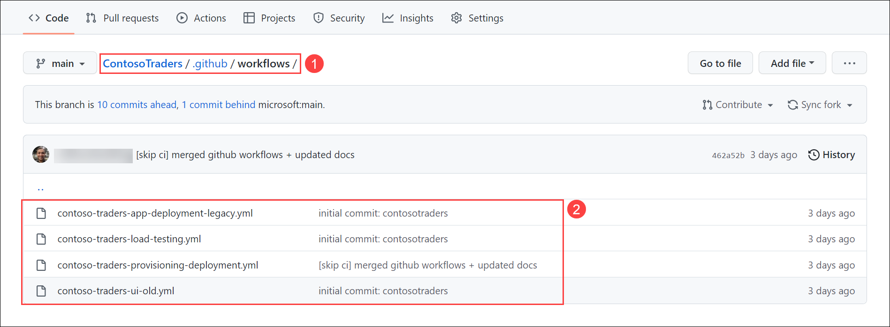

# DevSecOps: L100

## Overview

Contoso Traders is one of the leading E-Commerce platforms with a wide range of electronic products like desktops and laptops, mobile phones, gaming console accessories, and monitors. This includes a wide range of international brands like Microsoft Surface, XBOX, Samsung, ASUS, DELL etc. Contoso Traders Organization is using Microsoft 365 for their collaboration works internally.

Contoso Traders has different departments like marketing, sales, accounts, HR, and IT. For internal communication, they are using Microsoft Teams and Outlook. In the Contoso Traders organisation, there are various functionalities with the Contoso Traders E-commerce platform like product approval, product price approval, Product price update approval etc. 

## Context

You will explore the Contoso traders code base present in a GitHub repository which contains all the files related to the application’s UI, backend APIs, deployment files, GitHub workflows, and deployment guides. You will also explore about GitHub security features like Dependency graph and Dependabot. You will also explore Azure Defender for cloud and how it protects the rsoources

## prerequisite

Before proceeding to next steps. The application and related resources should be deployed and configured. If not deployed, please follow the **Deployment** documentation to complete the deployment.

## Steps

1. Open browser, using a new tab navigate to `https://www.contosotraders.com/` **(1)**. If you see `Your connection isn't private` warning then click on **Advanced** an select **Continue to contosotraders.com (unsafe) (2)**

   
   
1. The products are seperated based on different catagories like **Laptops**, **Controllers**, **Desktops**, **Mobiles**, and **Monitors**.   
      
         
   
1. Navigate to any category and select any of the product. You'll be able to see details like **technical description of the product**, **bank offers**, **Question and Answers** related to the product.

     
   
1. In a new browser tab open `https://www.github.com` and Log in with your personal GitHub account.

   **Note** : You have to use your own GitHub account. If you don't have a GitHub account then navigate to the following link `https://github.com/join` and create one.   
   
1. Open browser, using a new tab navigate to your forked **ContosoTraders** repo (`https://github.com/<GITHUB USERNAME/ContosoTraders`) GitHub repository. This repository conatins all the neccessary files and documents which will guide you to host the contoso traders application from the scratch.

    

1. Navigate to **github/workflows (1)** folder, it contains the **workflow YAML files (2)** using which you can deploy and configure the resources. Each workflow has its own functionality.

    

1. The **docs** folder contains the deployment instruction files, which guide you to deploy the infrastructure and application.

   

1. The **iac** folders contain the BICEP templates, which deploy the infrastructure needed for the application.

    

1. The **src** folder contains all the source code files related to backend APIs, UI, and other parts of the application.

     

1. The **tests** folder contains the files related to load testing.

      

1. From the **code** tab, scroll down a little and you’ll find the **links (1)** to access the application. There are different links for test, production UI. You can also access the **deployment instructions (2)** files using the links provided in the documentation paragraph.

     

1. If you scroll a little bit more, you’ll visualise the entire application infrastructure diagram. The diagram explains how different Azure resources are integrated together and runs in a synchronised manner to ensure the smooth operation of the application.

   

1. Navigate to **github/workflows** folder, it contains the workflow YAML files using which you can the deployment resources. Each workflow has its own functionality.

      

1. **Contoso-traders-infra-deployment.yml** will deploy the infrastructure into Azure which includes resource groups, resources, sets access policies to key vaults, and seeds the database from storage accounts into an Azure SQL database.

    

1. **contoso-traders-app-deployment.yml** deploys the application to Azure cloud. The application is configured to use the pre-deployed resources.

    

1. **contoso-traders-load-testing.yml** configures the load testing for the application.
  
   

1. From the GitHub repository, navigate to **Actions (1)** tab. You’ll see the different **GitHub workflows (2)** in the Actions sidebar.

     

1. The **contoso-traders-infra-provisioning (1)** workflow is configured to deploy the BICEP templates which will deploy the whole infrastructure to Azure. To run the workflow, click on **Run workflow (2)** and select **Run workflow (3)** to trigger the action.

     

1. The **contoso-traders-app-deployment (1)** workflow is configured to deploy the application to Azure cloud. The workflow uses the resources which were deployed from contoso-traders-infra-provisioning workflow. To run the workflow, click on **Run workflow (2)** and select **Run workflow (3)** to trigger the action.

      

1. The **contoso-traders-load-testing (1)** workflow will configure load testing on the application. To run the workflow, click on **Run workflow (2)** and select **Run workflow (3)** to trigger the action.

   
   
1. Navigate to **Settings (1)** tab, select **Code security and analysis (2)** tab. Here, **Dependency graph**, and **Dependabots** are enabled. 

    - **The dependency graph** contains all of a repository's dependencies as detailed in the manifest and lock files, or their equivalents, for supported ecosystems, as well as any dependencies submitted via the Dependency Submission API.
   
    - **Dependabot alerts** tell you that your code depends on a package that is insecure or malicious.   

    - **Dependabot security updates** creates  alert for every vulnerable dependency identified in your full dependency graph. However, security updates are triggered only for dependencies that are specified in a manifest or lock file.
   
   
    
1. Navigate to **Security (1)** tab and select the **Dependabot (2)** from the side bar.

     
   
1. Select the **Improper Neutralization of Special Elements used in a Command in Shell-quote** alert.

   
   
1. Go through the alert description and click on **Review security update**.

   
   
1. You can **review (1)** the changes that will be made to resolve the alerts. By clicking on **Merge pull request (2)** button, you can resolve the alert. This how you make the repository more safer and eliminate the vulnerabilities.

   
   
1. Now, sign in to your Azure account, where the contoso traders infrastructure is hosted. If the infrastructure is not deployed, please follow the **Deployment setup** documentation.

1. From the Azure portal, search for **Microsoft Defender for cloud (1)** from the search and select **Microsoft Defender for cloud (2)**.

   
   
1. From Microsoft Defender for cloud page, select **Environment settings (1)** tab from the sidebar and click on your **subcription (2)**      
      
   
   
1. In the Settings | Defenders page, you'll be able to see all the resources for which Azure Defender plan is enabled. These are resources which are protected by the Defender plan.
 
   - Azure Defender for cloud finds weak spots across your cloud configuration, helps strengthen the overall security posture of your environment.

      
   
1. Navigate back to Microsoft Defender for cloud page, select **Recommendations** from the side blade.

   
   
1. In the Recommendations page, select the **All recommendations (1)** tab. You'll be able to see a bunch of recommendations based on severity. 
 
    - Using the policies, Defender for Cloud periodically analyzes the compliance status of your resources to identify potential security misconfigurations and weaknesses. It then provides you with recommendations on how to remediate those issues. Recommendations are the result of assessing your resources against the relevant policies and identifying resources that aren't meeting your defined requirements.

    
  
1. In the Recommendations page, scroll down a bit and you'll be able to see a set of recommendations for the protected resources and click on any of the recommendation to see the details.

    
  
1. Here, you can see the **Description** of the recommendation. Using **Remidiation steps**, you can fix the vulnerability. Alos you can check the affect**Affected resources**.

     
   
1. Navigate back to Microsoft Defender for cloud page, select **DevOps Security (preview)** from the side bar.

   
   
1. **Defender for DevOps** allows you to manage your connected environments and provides your security teams with a high level overview of discovered issues that may exist within the repository. Click on the **ContosoTraders** GitHub repository.

   
   
1. Select any one of the **Recommendations** from the list.

   
   
1. Take a look at the **Descrption** of the recommendation. Using the steps mentioned in the **Remeditaion steps**, you can take action and resolve the issue.

   
   
## Summary

You have understood and got an overview about the Contoso Traders website, GitHub repostory, GitHub security features, and Microsoft Defender for cloud and DevOps.

    
