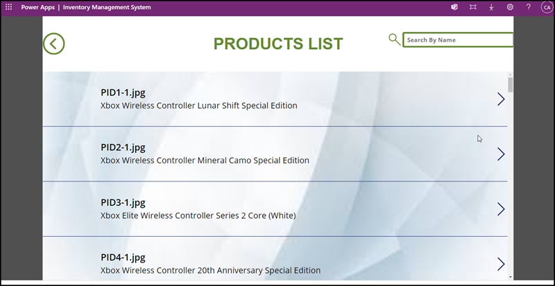
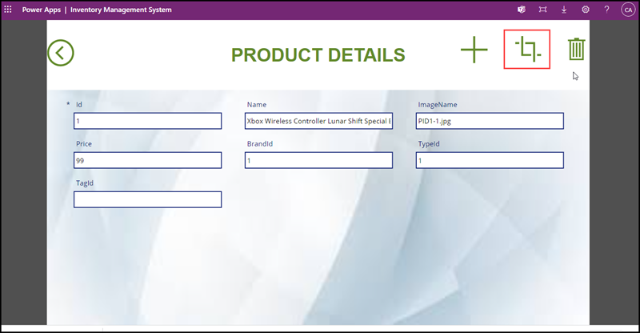
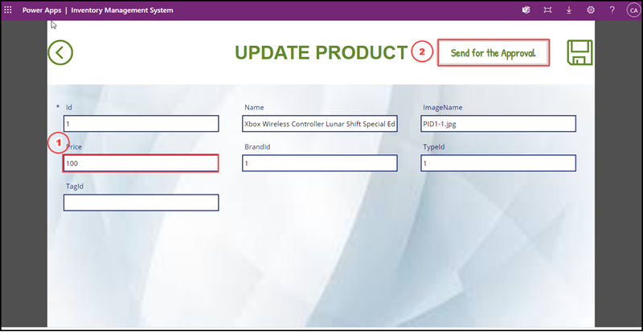
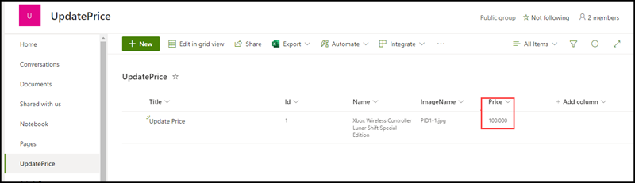
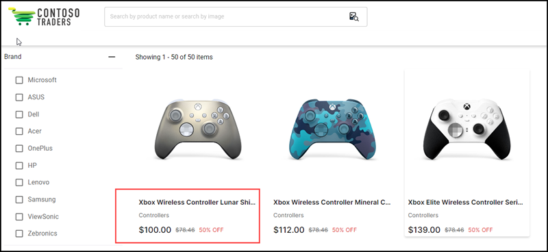

**LOW CODE DEVELOPMENT – HIGH LEVEL SCENARIO WALKTHROUGH**

Contoso Traders are one of the leading E-Commerce platform with wide range of electronic products like Desktops and Laptops, Mobile Phones, Gaming console accessories and Monitors. This includes a wide range of international brands like Microsoft Surface, XBOX, Samsung, ASUS, DELL etc. Contoso Traders Organization is using Microsoft 365 for their collaboration works internally.

Contoso Traders has different departments like Marketing, Sales, Finance, HR, IT. For internal communication they are using Microsoft Teams and Outlook. In Contoso Traders Organization, there are various functionalities with the Contoso Traders E-commerce platform like product approval, product price approval, Product price update approval etc. 

Contoso Traders internal teams wants to avoid manual collaboration and configure the approval process getting done automatically.
To do the automation we are using Power App Studio and Power Automate along with Adaptive Cards.

Problem Statement(s):
1.	In Contoso Traders for internal and external workflows collaborations there are several processes going on for different database transactions. A new product need to add into the product database, updating price of a product or deleting a product from the database, Contoso Traders depends Microsoft365 emails for the internal collaborations.
2.	In the current approval process, the approvers (managers) getting the approval notifications in their emails and its difficult to find which category of item is getting approved also need to check the product details manually and which team member sending the approval request and the details of the request. Also, its difficult for the users to send emails to the approver when the price of a product change happens. Once the approver approved the request and sent back the notifications to the users, users should update the price manually in the system.
3.	When the Finance Team wants to change the price of a product and get it approved from the approver, they are following the current process. At the same time, multiple teams sending the request for updating the price, the approver find it difficult to view all the request notifications in the email, also the details of the product and the requester. In the current scenario there are so much mismatch happens when the price changes of different products happens.
4.	Approver needs to view the product details and the requestor before approving the price change of any product. Also when the approver approved the request the change of the price of that particular product should update automatically in the website as well as the database.

Solution

1.	Microsoft 365 is the collaboration platform for business users. Microsoft 365 offers different applications like Microsoft Office, Outlook, Teams, Power Platform, SharePoint etc. To resolve the issues in the current scenario, Contoso Traders decided to build an app in power platform  by using MS Cloud services like, Teams, cosmos etc., allowed to implement an end to end solution which’d update price on final website (contosotraders.com) with zero manual efforts from engineering/other teams and is fully automated with approval process in place. 
2.	PowerApps allows us to build custom apps, to accommodate our business needs or solve our issues when we cannot find a suitable off-the-shelf solution. PowerApps can easily connect to our stored business data, which is either located in Microsoft Dataverse or within an on-premise/online data source, for example; Excel, SharePoint, Office 365, SQL Server and Dynamics365. Also service in the Power platform  named Power Automate  can use for creating workflows to automate our processes.
3.	Created a custom Power App named Inventory Management System along with Power Automate workflow. This Inventory Management System App helps business users to easily update the price of a product by taking the approval from the corresponding approvers (managers).
4.	When a business user send the approval request for updating the price of a particular product to the Approver through the Inventory Management App, a request will trigger in Microsoft Teams channel and the approver can view the request and open the view items in the request to view the product details to be updated. When the approver approves the request, business user can view it at the same time and the price will update in the website as well as database automatically. When the approver rejects the request business user can view the message at the same time.

Walkthrough 
		Now, Let us try the Inventory Management System App and see how it executes.  			We are going to launch the App and make some pricing updates to XBOX 				Controllers. 
1.	Launch the app by opening URL.  https://make.powerapps.com/environments/Default-08b2a7bc-d241-4500-a789-a1f56bb0cfd9/apps 
2.	Once the Power Platform get loaded and ask for the credentials, enter the credentials given by Cloudlabs, and then select Contoso Traders default environment.
3.	Go to the Apps tab and Click on Inventory Management System

       
       
4.      After launching the app enter the credentials provided by cloudlabs and click on Login

	
	
5.      After click on Login you will enter into the Inventory Management Screen. Let us look at product and find out the product where we need to update the price. 
	
	

6.	You will enter into Product List Screen and scroll it down or you can search by name in the search box, all the products you can see there and click on any product to see the details of it.	

	
	
7. 	When you click on the first product to see the details, it will enter into the Product details screen. Let us update price from 90 to 100, as per the request from Finance teams

	
	
8. 	To update the price of the product, click on the Update Icon on the top of the screen.
9.	After reaching into the Update Product Screen change the price to 100 and click on Send for the Approval.

	
	
10.     You will receive a message showing Sent for approval.
11.	Now, approval request is sent to stakeholders. They’ll see in their teams channel. Let us login as one of the stakeholder and try it out. 
12.	Check Microsoft Teams TailwindTradersApproval and channel named ProductPriceUpdate.
**(Note: When you are login into the Microsoft Teams please use the credentials used for enter into the power platform environment. Refer : Go to step no:II.)

	
	
13.	When you enter into the channel mentioned above, review the adaptive card request and click on view items, you can see the product details to be updated in a sharepoint list.

	
14.	After viewing the price When you click on the approve button in the Microsoft Teams channel, it will send a message “Approved” and updated the new price in the website, also you will receive another message in the Teams channel “Price Updated”.

	
	
15.	You can see the Updation of the price in the Website also by clicking the following link 
https://www.contosotraders.com/list/controllers  

	
	
	Conclusion: Inventory Management System App successfully automated the process of update price request approval. Stakeholders can easily identify the details of the product to be approved and once it get approved it will automatically update in website as well as database.

	
