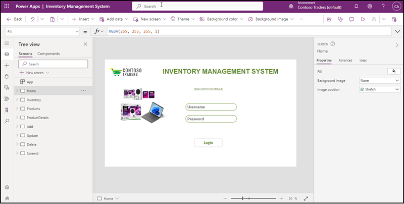

**Technical Walkthrough of Solution**
------------------------------------

Power platform helps to build the Inventory Management System App for resolving the issues in the current scenario of Contoso Traders. It enables the collaborations internally. Two main components of Power platform were used to build the application viz, PowerApp and Power Automate. Lets walkthrough each component and how its configured. 

1.	Power App
    Inventory Management System App was built in Canvas App by using cloud database connectivity. Databases are kept in Azure SQL Database. We can use the app for CRUD operations. In Contoso Traders they need the Update operation through an automation process, before update the price of any product the stakeholders should approve and once it get approved the price will updated automatically. Based on this scenario the App built and it has eight screens. Lets go through each screen and explore how its configured and what are the scripts and formulas applied.  

Screen1-Home

    Home Screen allows to login into Inventory Management System App.
    In Home screen added the Text labels for “Inventory Management System” and “Sign into continue”. Added Contoso Traders logo and some images. 
    Also added two Text inputs to enter username and password. Configured the password Text input’s property mode as password and provided hint texts to both text inputs. Added a login button and configured the connection with a SharePoint list having Contoso Traders business users data. It will validate the username and password entered into the Home screen.

      
      
