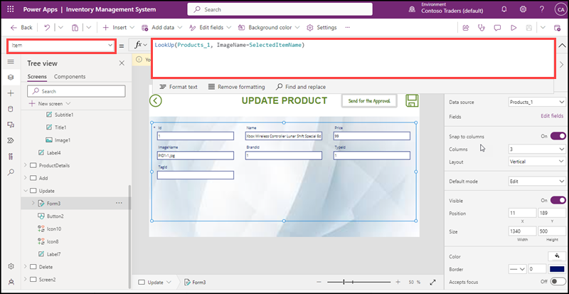
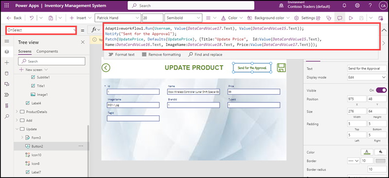
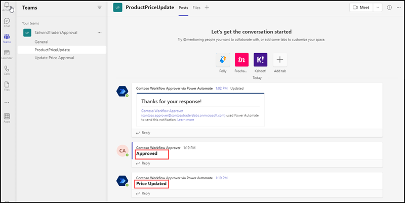
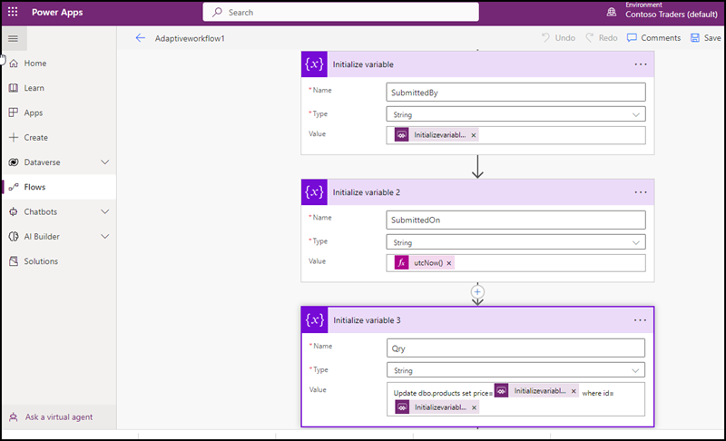
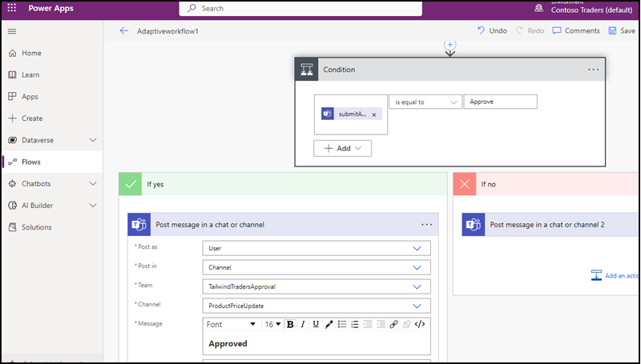
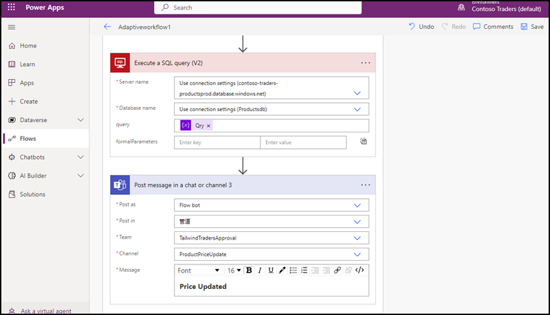
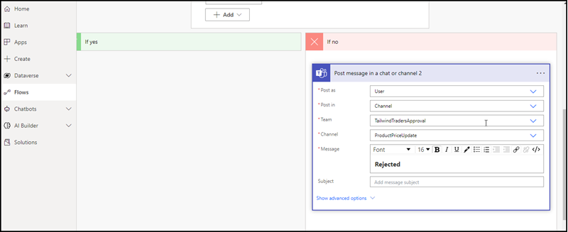

**Technical Walkthrough of Solution**
------------------------------------

Power platform helps to build the Inventory Management System App for resolving the issues in the current scenario of Contoso Traders. It enables the collaborations internally. Two main components of Power platform were used to build the application viz, PowerApp and Power Automate. Lets walkthrough each component and how its configured. 

**Power App**

Inventory Management System App was built in Canvas App by using cloud database connectivity. Databases are kept in Azure SQL Database. We can use the app for CRUD operations. In Contoso Traders they need the Update operation through an automation process, before update the price of any product the stakeholders should approve and once it get approved the price will updated automatically. Based on this scenario the App built and it has eight screens. Lets go through each screen and explore how its configured and what are the scripts and formulas applied.  

1. Home Screen allows to login into Inventory Management System App. In Home screen added the Text labels for “Inventory Management System” and “Sign into continue”. Added Contoso Traders logo and some images. Also added two Text inputs to enter username and password. Configured the password Text input’s property mode as password and provided hint texts to both text inputs. Added a login button and configured the connection with a SharePoint list having Contoso Traders business users data. It will validate the username and password entered into the Home screen.

    
     
      
2. In the Login button’s Onselect property added code in the below image:
      
    
      
3. User will reach into Inventory Management Screen, by clicking on Product List they can view Product List screen having all the products listed from the database named Productdb. They can scroll it down to view all the Products. If they want to check a particular product details they can click on the name of the product and it will navigate to Product Details Screen. If they decided to update the product, they can click on the Update icon on the top of screen. It will navigate to Product Update Screen. Here as an example the price of the Product named “XBOX wireless controller lunar shift special edition” is going to be updated. Current price of the product is $99, after updating the price to $100 click on “Send for approval” button, it will trigger an approval request to the teams, and the stakeholders can approve the request, once it get approved, business user can see the message as approved and automatically the amended price will be updated in the website as well as the database. So getting this desired output, on the update screen added one Edit form which connected to the datasource, and a lookup function set the item property of the form which will find single record matches the criteria, here the criteria is the record saved into a variable named “SelectedItemname”. So when a user select a particular product, the details of the product will save into the  variable and will display into the form. 
       
       
    
       
       
 4. Here on the “Send Approval” button configure a workflow named “Adaptiveworkflow1”. Also the updated details will be fetched into a SharePoint list named “UpdatePrice”.
       
    
       
 5. After clicking on the “Send for the Approval” button, it will trigger a notification message of Approval request into Microsoft Teams channel named “ProductPriceUpdate”. It has been configured by using Adaptive cards.

    
       
   
       
 6. In this Approval request we can see three buttons, one is for View Items, when the stakeholder click on view item it will redirect to a SharePoint list having the details of the product to be updated. Another two buttons are for Approve and Reject. When the Stakeholder click on Reject it will pass a message in the channel “Rejected”. When the stakeholder click on Approve it will pass a message in the channel “Approved” and immediately after a while another message will comes “Price updated”.
       
    
       
 Also it will automatically updated the price in the website as well as database.

**POWER AUTOMATE**

Let’s walkthrough the workflow named “Adaptiveworkflow1”. Here the requirement is when a business user trying to update the price of any product, it should automate an approval request to a Teams Channel and the stakeholder can approve it. To build the workflow Power automate tool has been used.

1. A simple instant cloud workflow has been created.

   
        
In this workflow three variables initialized with values submitted by, submitted on and an update T-SQL query respectively.
           
   
   
   
        
After that configured “Post an Adaptive card and wait for response” flow. In this flow, configured an Adaptive card in json script and pass value of two variables submitted on and submitted by into the adaptive card. 

*Refer the Adaptive card document* https://github.com/seenakhan/ContosoTraders/blob/main/demo-scripts/LOW%20CODE%20DEVELOPMENT/Adaptivecard.json 

After that a Condition control flow configured with a condition body(‘PostAdaptiveCardToChannelAndWaitforaresponse’)[‘submitActionId’] is equal to Approve. Along with the condition If Yes and IF No flows also configured When the stakeholder click on the Approve button then the If yes flow will execute. It has additional three flows added two flows are for passing the message on the Teams channel and One flow is for calling the variable having T-SQL update query. Below are the images shows the If Yes flow configuration.

 
    
  
    
And for the If No flow configured a Post message in a chat or channel 2. Below image shows the same:

   

**Conclusion: With Power platform tools automation for any complex business scenarios can be configured and deployed easily. We can do more use cases by using various functionalities of Power platform tools.

      
      
      
