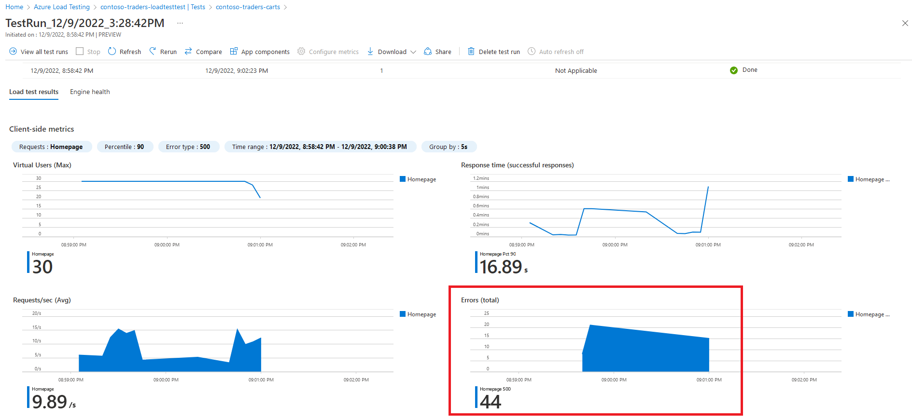
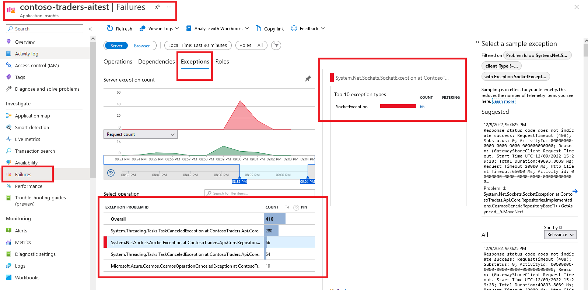
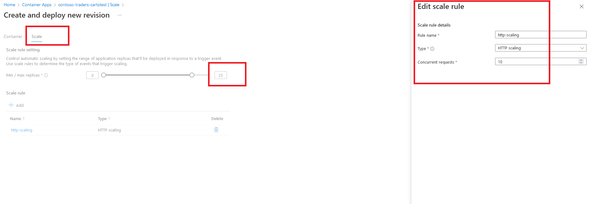

# Autoscaling Cloud Native Apps on Azure: Overview

## Key Takeaways

In this demo, we'll do a deep dive on the autoscaling capabilities of various Azure services like ACA (Azure Container Apps) and AKS (Azure Kubernetes Service).

You'll also get an insight into how to use Azure Monitor to monitor the application's performance and health.

All these are especially crucial for an e-commerce application like Contoso Traders, which is expected to instantly handle a large, sudden spike in number of users, with low latency and no downtime.

## Before You Begin

* There are some prerequisites for this demo mentioned in the [application deployment guide](../docs/../../docs/app-deployment-guide.md). After executing all the steps mentioned in that document, the application's infrastructure will be provisioned on Azure, and the latest code will be deployed as well.

* Prior to attempting this exercise, you should first execute the [autoscaling overview exercise](./overview.md).

## Walkthrough: Without Autoscaling

1. In the Azure portal, you can navigate to the Azure Container App in the `contoso-traders-rg` resource group.

   

2. You can create a new revision without scaling enabled (i.e. max instances = 1).

   

   

3. Next modify the github workflow file `.github\workflows\contoso-traders-load-testing.yml` to increase the `threads_per_engine` to (say) 30. Now commit the change to the `main` branch.

   

4. Manually execute the github workflow from the portal.

   

5. Since ACA cannot scale out beyond 1 instance, the API will starting failing.

   

6. Azure Application Insights (where the API app sends its traces & telemetry) will have the fine-grained details of the failures.

   

## Walkthrough: Autoscaling in Action

1. Let's configure a `HTTP Scaling` rule that horizontally scales out to (say) 25 replicas. Also let us set a scaling rule `http-scaling` that causes ACA to create replicas when there are more than 10 concurrent requests.

   

2. You can now re-run steps 4 to 6 from first walkthrough above (i.e. re-run the load test).

3. This time you shouldn't encounter any failures. The API will be able to handle the load by automatically scaling out to 25 replicas. Once the load subsides, the replicas will be scaled back in.

   

## Summary

In this demo, you got an deep dive into the autoscaling features of Azure services like ACA (Azure Container Apps). You can now head over to the [other demos](../../demo-scripts/) of this app.
