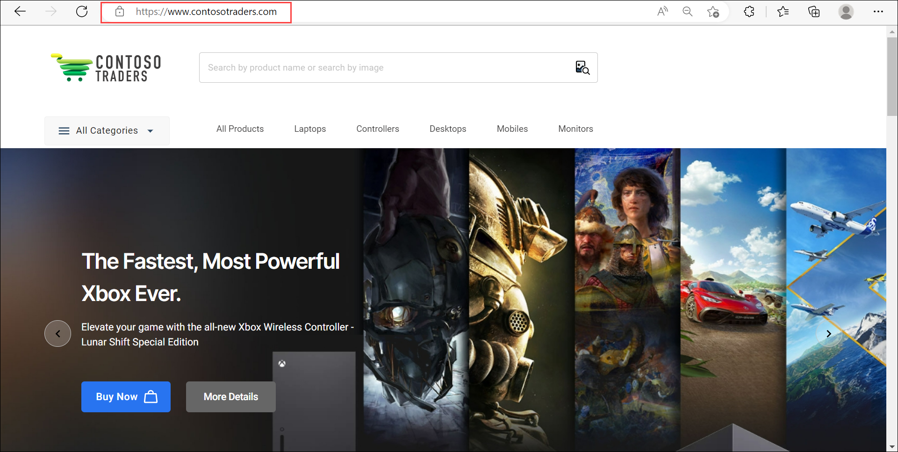

# Cloud Native App Architecture : Overview

## Key Takeaways

The key takeaways from this demo are:

* You'll get an overview of the application's architecture.
* You'll also get an insight into the various Azure services that this application leverages.

## Before You Begin

* No prerequisites are required for this specific demo.

## Walkthrough: Exploring the application's architecture and the Azure services leveraged

Here's a quick snapshot of the Contoso Traders's application architecture. The various components can be broadly categorized as follows:

### DevOps

The application's source code, tests and deployment scripts (IaC) are all available in this GitHub repository itself. We also have CI/CD pipelines (github workflows) that build the various application components, and deploy them to Azure Cloud.

An Azure Container Registry (ACR) is used to store the container images for the application's microservices. The ACR is integrated with the GitHub repository, and the container images are built and pushed to the ACR whenever there is a commit to the repository's `main` branch.

### Front-End Infrastructure

The front-end is a React JS application that is hosted on Azure App Service. The front-end application is also configured to use Azure Application Insights for monitoring and telemetry.

Power Apps is used to create the Shipping Management App where this app will be managing shipment. Storage Account is a repository of images of the products available in the application.

CDN is used to cache the static content of the application, and to serve it from the nearest edge location. This helps in reducing the latency and improving the performance of the application.

### Back-End Infrastructure

API Management (gateway) is used to expose the application's microservices to the front-end. Common policies such as authentication, authorization, rate limiting, caching etc. are configured in API Management. The API Management is also configured to use Azure Active Directory for authentication and authorization.

### Back-End APIs and Databases

The application's APIs are built using .NET 6, and are deployed as containerized applications. We have three primary APIs:

* Products/Stocks API: This API is deployed as a containerized application on Azure Kubernetes Service (AKS). It is used to manage the products and their inventory. It uses both Azure SQL Database (product catalog) as well as Azure Cosmos DB (stock/inventory) for its persistence.

* Carts API: This API is deployed as a containerized application on Azure Container App (ACA). It is used to manage the shopping carts operations. It uses Azure Cosmos DB as its repository.

* Image Search API: This API is deployed as a containerized App Service. It is used to search for matching products with user-submitted images. It primarily relies on Azure Cognitive Search (Computer Vision).

All these microservices are also configured to use Azure Application Insights for monitoring and telemetry.

### Monitoring and Telemetry

Application Insights is used to monitor the application's performance and health. It is also used to collect telemetry data (metrics, events, logs) from the various components of the application. The telemetry data is used to generate dashboards and alerts.

### Security

Azure Active Directory (AAD) is used to manage the application's users and groups. AAD is also used to authenticate and authorize the application's users. The application's APIs are configured to use AAD for authentication and authorization.

Microsoft Defender is used to monitor the application's security posture. It is also used to detect and respond to security threats to the infrastructure.

## Walkthrough: Launching the application

1. Open browser and navigate to [https://www.contosotraders.com/](https://www.contosotraders.com/)

   

   On this webpage, you'll be able to see the e-commerce store with clusters of electronic products such as laptops, game controllers, desktops, mobile phones and monitors of different brands.

## Summary

We hope this demo was helpful in giving you an overview of the application's architecture and the various Azure services that this application leverages. We have a more detailed technical walkthrough of this application in [the next demo](./technical-walkthrough.md).
