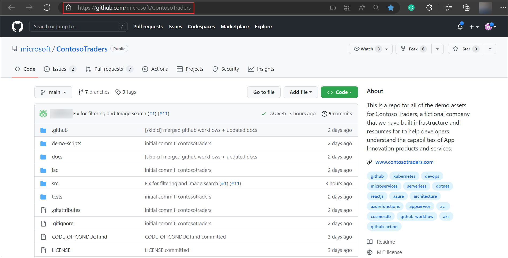
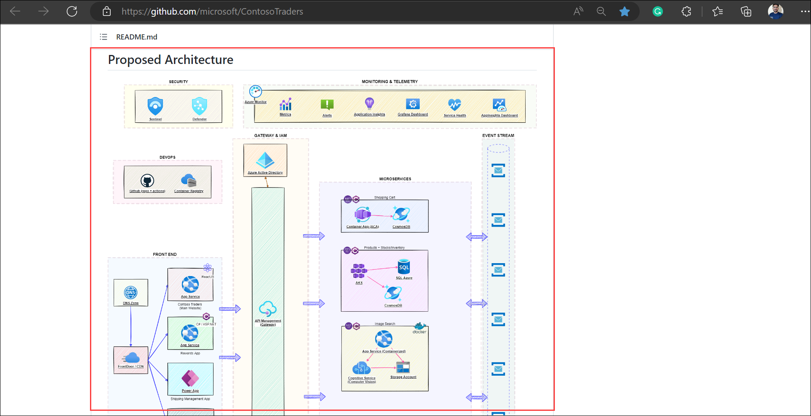
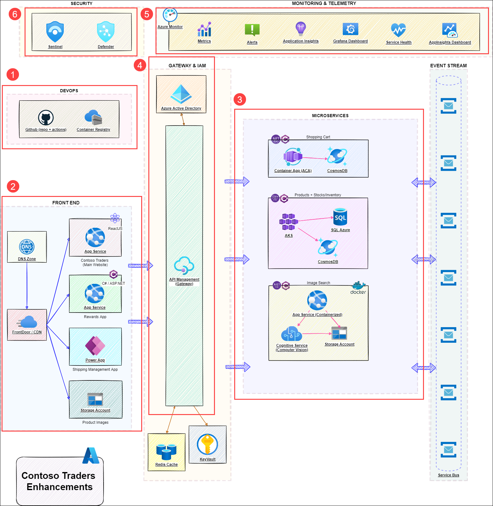
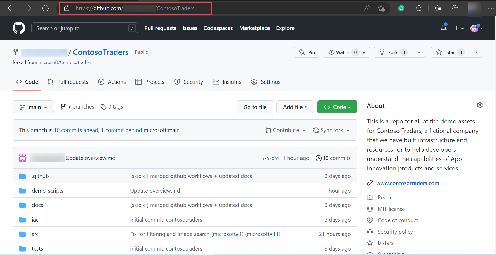
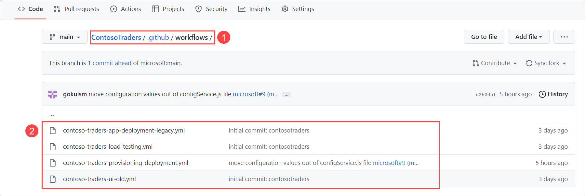
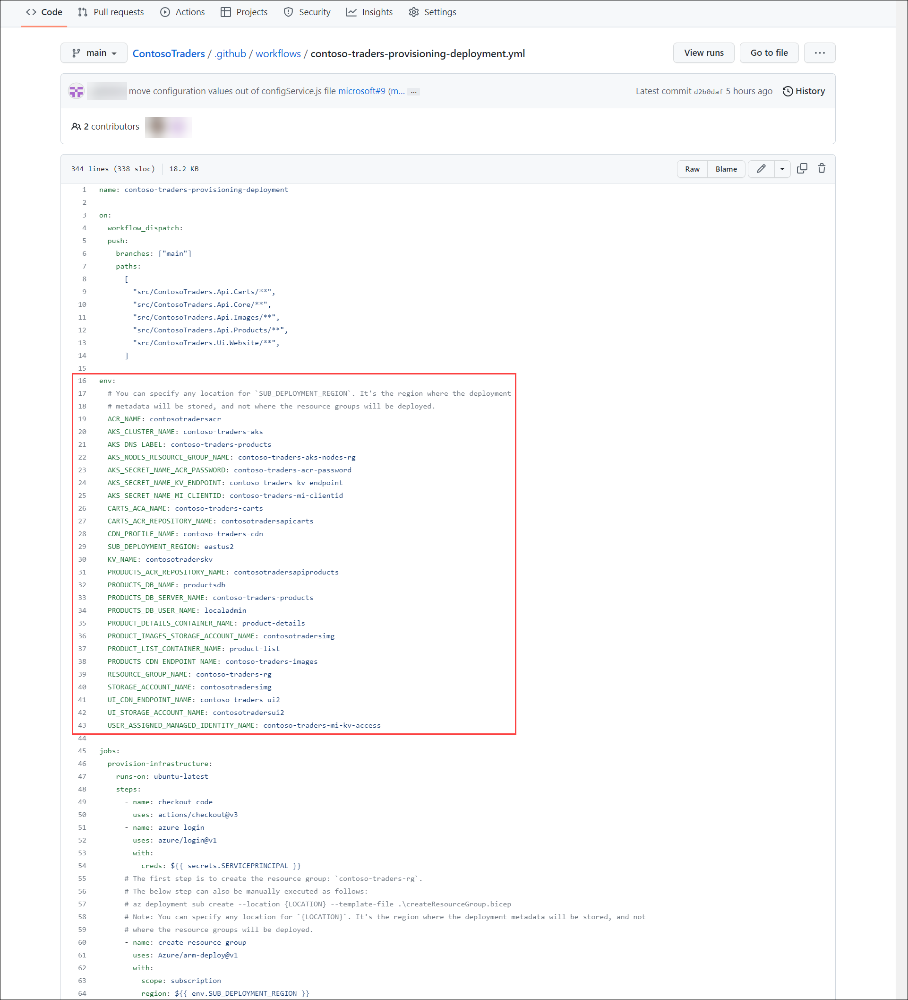
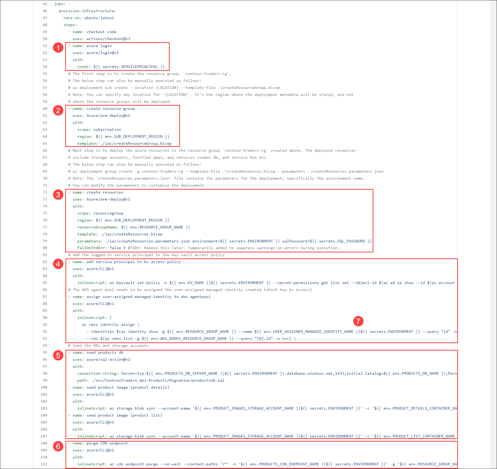

# Technical Walkthrough: Cloud Native Infrastructure

## Overview of the Contoso Traders application

Contoso Traders is one of the leading E-Commerce platforms with a wide range of electronic products like desktops and laptops, mobile phones, gaming console accessories, and monitors. This includes a wide range of international brands like Microsoft Surface, XBOX, Samsung, ASUS, DELL etc. Contoso Traders Organization is using Microsoft 365 for their collaboration works internally.

Contoso Traders has different departments like marketing, sales, accounts, HR, and IT. For internal communication, they are using Microsoft Teams and Outlook. In the Contoso Traders organisation, there are various functionalities with the Contoso Traders E-commerce platform like product approval, product price approval, Product 

## Key Takeway

1. **Archiecture Contoso Traders application**: The complete architecture of the Contoso Traders application is explained. The architecture is divided into multiple sub-components which covers different aspect of the application.

1. **Demo of Azure Deployment**: You 

## Walkthrough

### Archiecture Contoso Traders application

In this walkthrough, You will understand the architecture of the Contoso Traders application and its different components.

1. Open browser, using a new tab navigate to `https://github.com/microsoft/ContosoTraders` GitHub repository. This repository conatins all the neccessary files and documents which will guide you to host the contoso traders application from the scratch.

   
   
1. Scroll down a bit, In the **Proposed Archtecture** section you'll see the the architecture diagram of the complete application.   

   
   
1. The architecture is broken down into mulitple parts and the major ones are, **DEVOPS (1)**, **FRONT END (2)**, **MICROSERVICES (3)**, **GATEWAY & IAM (4)**, **MONITORING AND TELEMETRY (5)**, and **SECURITY (6)**.  
   
   - **DEVOPS**: Using the GitHub repository and GitHub actions, the resources are created. Individual docker images are built and pushed to Azure container registry. The same docker images will be pulled by Azure container apps, Kubernetes cluster, and App services which will host different parts of the application.
   
   - **FRONTEND**: Frontend is basically a ReactJS application hosted in Azure App service which works with backend(microservices) in a synchronized manner to get data.
  
   - **MICROSERVICES**: There are 3 components of the application which are containerized that is, Shopping cart, products + carts, and Image search.**Shopping cart** is hosted in Azure container instance which pulls the image from container instance. **Products + carts** is hosted in Azure Kubernetes cluster which is deployed by pulling the image from container instance. **Image search** is hosted in conatinerzied App service.
   
   - **GATEWAY & IAM**: All the resources, identities communicate using Azure APIs to provide seamless experience inorder to keep up the website up and running. Azure Key vault is used to store all the sensitive keys and secrets, access policies are created which is assigned to resources and identities which uses the stored keys and secrets as needed.
   
   - **MONITORING AND TELEMETRY**: Azure Monitor, Application Insights, and Log Analytics is used to collect the logs and telemetry which can be used to check features like availabilty, performance, scability, etc of the resources.
   
   - **SECURITY**: Microsoft Defender for cloud and DevOps are used th protect the resources and GitHub repository from vulnerabilities and threats. 
   
   
   
1. Open browser, using a new tab navigate to your forked **ContosoTraders** repo (`https://github.com/<GITHUB USERNAME/ContosoTraders`) GitHub repository. This repository conatins all the neccessary files and documents which will guide you to host the contoso traders application from the scratch.

    
   
### Deploying the application to Azure

In this walkthrough, Let's explore and understand the GitHub Wworkflows which deploys the Contoso traders application in detail.

1. Navigate to **github/workflows (1)** folder, it contains the **workflow YAML files (2)** using which you can deploy and configure the resources. Each workflow has its own functionality.

      
   
1. Click on **contoso-traders-provisioning-deployment.yml** to open the workflow. The workflow has multiple jobs which deploys/configures the different parts of application architecture. Many **environment variables (1)** are defined which are basically names of the resources which will be created as part of the pipeline. Let's dive in depth and look at all the jobs. 

     
   
1. The first job **provision-infrastructure** is the one which deploys the Infrasructure to Azure. Let us look at the each component of the job.

   - **azure login (1)**: The checkout component step automates the Azure sign in using the details defined in a secret named **SERVICEPRINCIPAL**.
   
   - **create resource group (2)**: This step creates an **Azure resource group**, A bicep template named **createResources.bicep** bicep template which is present in `ContosoTraders/iac` directory.
   
   - **create resources (3)**: This step deploys the all the **Azure resources** which are defined in **createResources.bicep** template which is also prsent in `ContosoTraders/iac` directory.
   
   - **add service principal to kv access policy (4)**: This step creates and assigns **Key vault access policy** to the service principal.
   
   - **assign user-assigned managed-identity to aks agentpool (5)**: This step assigns the **service principal** to the **Virtual machine scale set** which gets created as part Azure Kuberenetes service deployment.
   
   - **seed products db (6)**: This step **seeds** the **SQL database** from a storage account.
   
   - **purge CDN endpoint (7)**: This step purges the **CDN Endpoint**.

    
   
1. The second job **deploy-carts-api**, it builds a docker image of the carts-api and pushes it to Azure container instance. Let us look at the each component of the job.

   - **azure login (1)**: The checkout component step automates the Azure sign in using the details defined in a secret named **SERVICEPRINCIPAL**.
   
   - 

