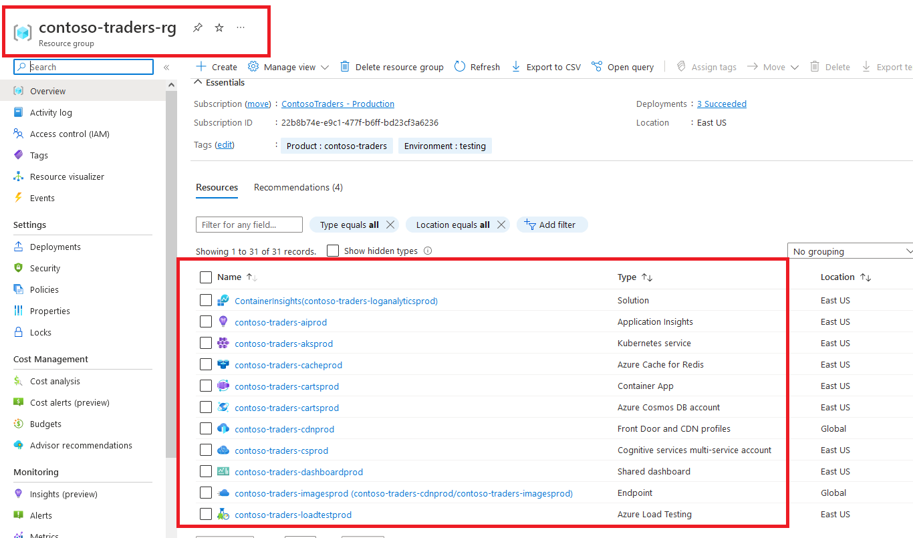
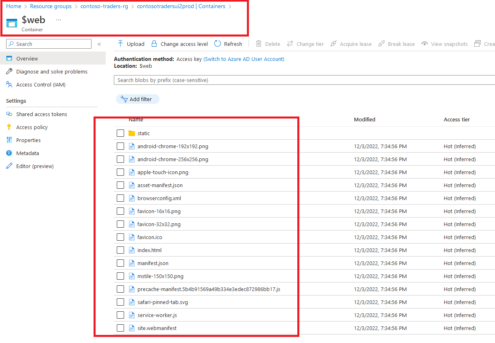
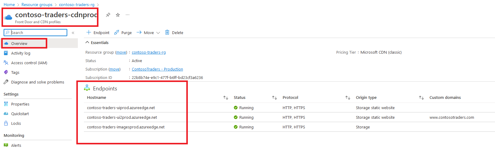
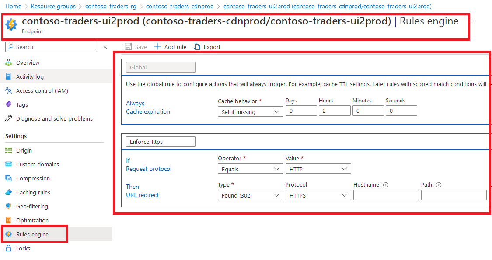
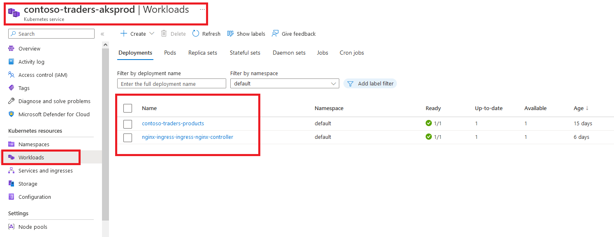

# Cloud Native App Architecture: Technical Walkthrough

## Key Takeaways

The key takeaways from this demo are:

* You'll revisit the overview of the application's architecture.
* You'll revisit the various Azure services that this application leverages.
* You'll get a hands-on experience of deploying the application to Azure.

## Before You Begin

* There are some prerequisites for this demo mentioned in the [application deployment guide](../docs/../../docs/app-deployment-guide.md). After completing all the steps mentioned in that document, the application's infrastructure will be provisioned on Azure, and the latest code will also be deployed.

## Walkthrough: Exploring the application's architecture

This section has already been covered in our previous overview document. You can refer to it [here](./overview.md).

## Walkthrough: Exploring the application's infrastructure on Azure

Open the Azure Portal, and navigate to the resource group that was created for this demo. The resource group name will generally be `contoso-traders-rg`.

All the resources related to the application will be provisioned in this resource group. Let's take a look at the various resources that have been provisioned.

### Front-End Infrastructure

1. The front-end is a React JS application that is hosted in an Azure storage account. The storage account has static website hosting enabled, and consequently, the `$web` container hosts the application code.

   

2. Azure CDN is used to cache the static content of the application, and to serve it from the nearest edge location. This helps in reducing the latency and improving the performance of the application. The CDN is configured to use the storage account as its origin.

   

3. CDN rules are used to:

   * manage `cache-control` headers (rules are configured to cache the static content for 2 hours).
   * enforce http to https redirection.

   

4. Another advantage of Azure CDN is that it allows custom domain HTTPS, along with managed TLS certificates.

   

### Back-End APIs

1. The back-end APIs consist of containerized .NET 6 applications, hosted on AKS (Azure Kubernetes Service), ACA (Azure Container Apps), and Azure App Service.

2. The container images are built by the CI pipeline (github workflows), and pushed to Azure Container Registry.

   

3. The various APIs then pull these latest/tagged container images from ACR, and deploy them to their respective hosting platforms.

4. The `Carts API` is hosted on ACA where traffic ingress has been enabled.

   

5. We use a `single: active` revision strategy for the `Carts API` on ACA. This means that only one revision (i.e. the latest revision) of the application will be running at any given time. New revisions are automatically created whenever a newer docker image gets pushed to ACR. The old revisions will be automatically decommissioned.

   

6. Each revision has a unique (revision-specific) endpoint/URL. However, you can also use the revision-neutral URL to access the application. This URL will always point to the latest revision.

   

   

7. The `Products API` is hosted on AKS. We have two deployments in the AKS cluster's `default` namespace: one for the API, one for the ingress controller (nginx).

   

8. Pods are deployed in the AKS cluster using a `rollingUpdate` strategy. This means that the new pods will be created first, and then the old pods will be decommissioned. This ensures that there is no downtime during the deployment. The `maxSurge` and `maxUnavailable` parameters are used to control the number of pods that can be created/decommissioned at any given time.

   

9. Container live-logs are enabled, users can view container & application activity in real-time. Historic logs are also accessible from a tethered Azure LogAnalytics workspace.

   

10. TLS certificates (from LetsEncrypt) are automatically provisioned for the `Products API` using the `cert-manager` addon. This enables HTTPs access to the API.

    

### Back-End Databases

1. The `Products API` primarily uses a SQL Azure database for storing the product catalog (accessed via the EFCore library)

   

2. The same API also uses an Azure CosmosDB database (SQL Core APIs) for storing the inventory/stock data.

3. The `Carts API` uses Azure CosmosDB (SQL Core API) for storing the cart data. The APIs uses CosmosDB SDK for all CRUD operations.

### Monitoring and Telemetry

1. Application Insights is used for monitoring and telemetry. It is enabled on all the API apps, and the front-end application. All traces, metrics, events to an Application Insights instance.

   

2. Azure Monitor will coalesce the telemetry data from the Application Insights instances, and provide a single pane of glass for monitoring the application (.e.g Application Map, Failures View, Log Queries).

   

   

### Security

1. All API apps have a user-assigned managed identity enabled on them. This MI has permissions to retrieve secrets (e.g. connection strings to databases) from the Azure KeyVault. This ensures that the secrets are not exposed in the application code.

    

2. Microsoft Defender for Cloud is enabled on the subscription. A secure score is calculated for the subscription, and recommendations are provided to improve the security posture of the subscription.

   

## Walkthrough: Launching the application

This section has already been covered in our previous overview document. You can refer to it [here](./overview.md).

## Summary

In this document, we revisited the application's architecture, and also got a tour of the various Azure services that this application leveraged. 

Next, you can understand the [application's codebase](../../src), and also explore the [other demo scripts](../../demo-scripts/).
