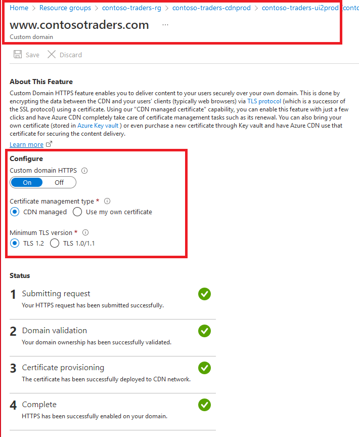

# Cloud Native App Architecture: Technical Walkthrough

## Key Takeaways

The key takeaways from this demo are:

* You'll revisit the overview of the application's architecture.
* You'll revisit the various Azure services that this application leverages.
* You'll get an hands-on experience of deploying the application to Azure.

## Before You Begin

* There are some prerequisites for this demo mentioned in the [setup instructions document](../docs/../../docs/setup-instructions.md)). After executing all the steps mentioned in that document, the application's infrastructure will be provisioned on Azure, and the latest code will be deployed as well.

## Walkthrough: Exploring the application's architecture and the Azure services leveraged

This section has already been covered in our previous overview document. You can refer to it [here](./overview.md).

## Walkthrough: Exploring the application's infrastructure on Azure

Open the Azure Portal, and navigate to the resource group that was created for this demo. The resource group name will generally be  `contoso-traders-rg`.

All the resources related to the application will be provisioned in this resource group. Let's take a look at the various resources that have been provisioned.

### Front-End Infrastructure

1. The front-end is a React JS application that is hosted in an Azure storage account. The storage account has static website hosting enabled, and consequently, the `$web` container hosts the application code.

   

2. Azure CDN is used to cache the static content of the application, and to serve it from the nearest edge location. This helps in reducing the latency and improving the performance of the application. The CDN is configured to use the storage account as its origin.

   

3. CDN rules are used to:

   * manage `cache-control` headers (rules are configured to cache the static content for 2 hours).
   * enforce http to https redirection.

   

4. Another advantage of Azure CDN is that it allows for custom domain HTTPS, along with managed TLS certificates.

   

### Back-End Infrastructure

### Back-End APIs and Databases

### Monitoring and Telemetry

### Security

## Walkthrough: Launching the application

This section has already been covered in our previous overview document. You can refer to it [here](./overview.md).
