# DevSecOps: L300

# DevSecOps with GitHub & Azure: Overview  

 
## Key Takeaways 

The key takeaways from this demo are: 

   - GitHub Actions is used to automate the deployment of the application and infrastructure. Using GitHub Action workflows, the application and infrastructure can be deployed to Azure cloud with a single click, allowing you to implement continuous integration and continuous deployment process.  
   - GitHub Actions integrates with Azure services to enable you to build, test, and deploy to Azure directly from your GitHub repository, along with tons of other integrations. 
   - GitHub Advanced Security is a set of tools that help you find and fix vulnerabilities in your code, protect your users, and detect and prevent malicious activity. GitHub Advanced Security is available for public and private repositories on GitHub.com and GitHub Enterprise Cloud. 
   - GitHub Advanced Security can be integrated with Microsoft Defender for Cloud to provide a unified view of security alerts and vulnerabilities across the entire DevSecOps pipeline. 
   - As part of this demo script, you will be making code change to the application and experience and end to CI/CD automation. 
   
  
## Before you Begin 

You must have Contoso Traders deployed in your environment and setup with GitHub Actions.  Please refer to the deployment instructions here. <link to deployment guide>

## Walkthrough – DevSecOps with Contoso Traders  

 
## Walkthrough – GitHub Actions for CI/CD 

 
GitHub Actions is a way to automate processes and workflows in your GitHub repository. Some of the benefits of using GitHub Actions include the ability to automate your software development lifecycle, integrate with other tools and services, including Azure services. 

Let us take a look at the GitHub Actions used by Contoso Traders for CI/CD. 

## Review Workflows used in Contoso Traders 

1. Navigate to https://github.com/microsoft/ContosoTraders  

2. Go to the **github/workflows (1)** folder; inside, you'll find the workflow **YAML files (2)** that are used to deploy and set up the resources.  

    
    
3. Here is a quick overview of both workflows. If you are interested, you can review the workflow code to get into more details.  

    a. **Contoso-traders-provisioning-deployment:**  This workflow provisions Azure resources used for hosting the application and deploys the application and initial data to the provisioned resources. 

     It includes everything needed to get the application up and running in an Azure Environment.  

      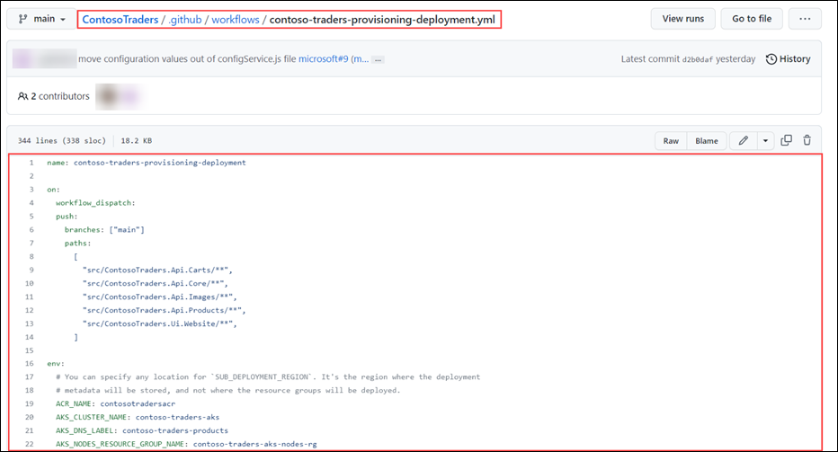

 
    b. **contoso-traders-load-testing:** This workflow runs a load testing against the ContosoTraders application using Azure Load Testing.  

      
      
## Monitor GitHub Actions Workflow 

GitHub Actions workflows can be monitored from the Actions tab on a repository. This tab shows a list of all the active and past workflows, along with their status and any associated logs. Users can see at a glance whether their workflows are running successfully and can troubleshoot any issues that may arise. Additionally, users can set up notifications to be alerted when a workflow starts or completes, or if it encounters an error. This can help users stay on top of their workflows and ensure that their projects are running smoothly. 

Let us take a look at the workflows status for Contoso Traders in this public repository.

1. Navigate to [ContosoTraders/Actions](https://github.com/microsoft/ContosoTraders/actions) 

    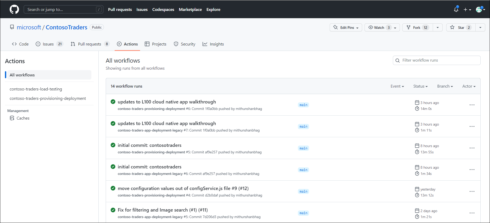
    
2. Select the workflow **contoso-traders-provisioning-deployment**. This will the history of workflows execution.  

    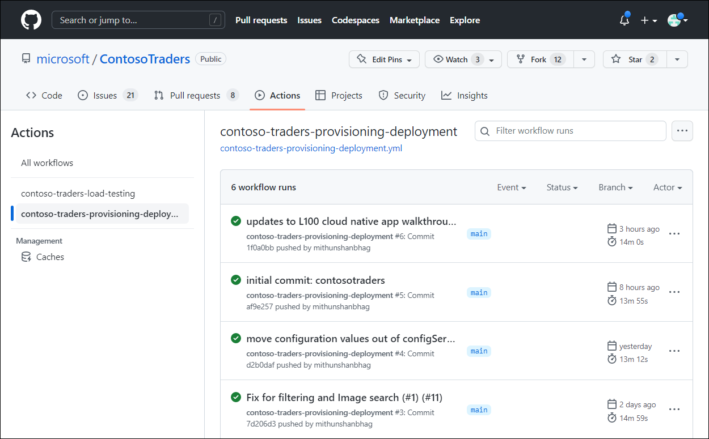

3. Select the latest run from the list. In Summary, you will see 4 jobs listed. 

    - Provision-infrastructure: Used for provisioning Azure resources, configure access policies and permissions, seeding initial database. 
    - deploy-carts-api: Used to deploy the Carts API in Azure Container Apps.  
    - deploy-products-api: Used to deploy Products API service in Azure Kubernetes Service. 
    - deploy-ui: Used to deploy the front end website to Azure App Service.  

    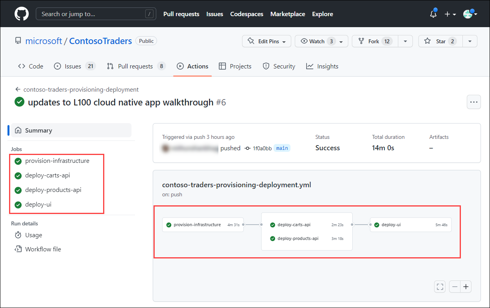

4. Click on **provision-infrastructure** job. You can now see the detailed task of this job and expand to see the logs and steps.

   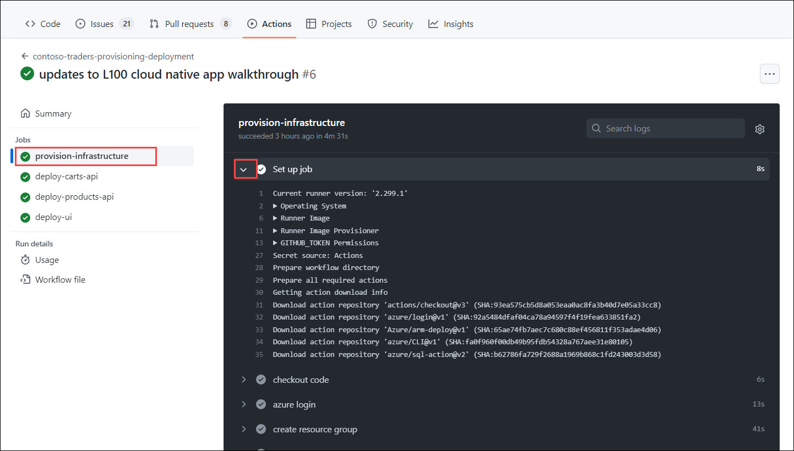

  Similarly, you can review other jobs and workflows. Workflow are set to run on push to the main branch so that any new code change to the main branch is automatically built and deployed. 
  
## Demo – Experience GitHub Actions in Action  

Now that we have reviewed the GitHub Actions workflows, let us take a step-by-step approach to test the end-to-end CI/CD process.  

Let us take a fictious scenario, Contoso Traders marketing team requires changing the about section in footer.  

Currently, it is set to “Contoso Traders is an e-commerce platform that specializes in electronic items. Our website offers a wide range of electronics, including smartphones, laptops, and other popular gadgets.” 

 
  

Your marketing team requires changing this to following 

Contoso Traders is one stop shop for electronics items including smartphones, laptops, and other popular gadgets. Contoso Traders delivery premium quality electronics at affordable rates to resellers across the globe.  

Let us make the changes and experience magic of GitHub Actions.  

 

1. Login to your fork of Contoso Traders repository and navigate to Contoso Traders repository https://github.com/**YOURUSERNAME**/ContosoTraders. 

2. Create a new branch **footer-update**.

    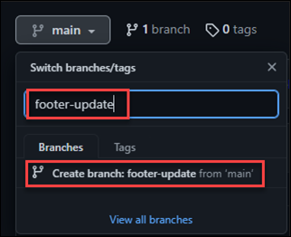
    
3. Navigate to footer.js file, located in  **.src/ContosoTraders.Ui.Website/src/shared/footer/footer.js **.

   
4. If you notice, the footer text is defined in **line#18 (1)**. Let us make an edit on this, click on edit **symbol (2)**.

    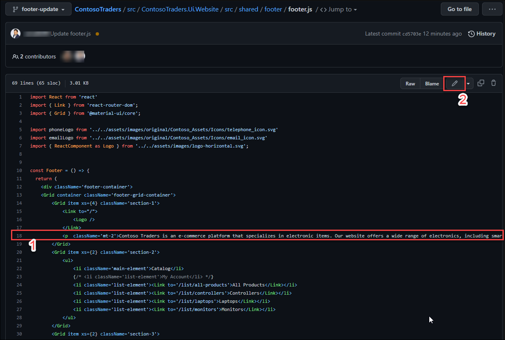

5. Replace the text with new text received from Marketing team. Line 18 should look like below.  

    
Contoso Traders is one stop shop for electronics items including smartphones, laptops, and other popular gadgets. Contoso Traders delivery premium quality electronics at affordable rates to resellers across the globe.
 
    
6. Commit the change to footer-update branch. Click on Commit changes after updating commit message.  

     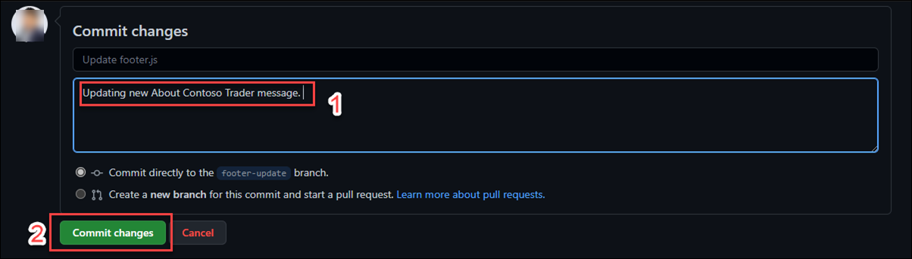
     
7. Now, let us raise a pull request to merge this change to **main branch**. Click on **Pull Requests** and notice that changes are detected already. Click on **Review and raise Pull Request**.

    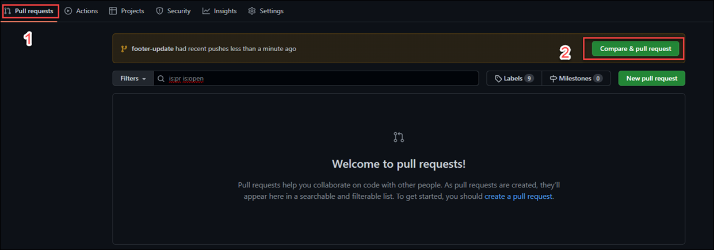

8. Change the base from microsoft/contosotraders to **YOURUSERNAME/contosotraders** and click **Create Pull Request**.  

    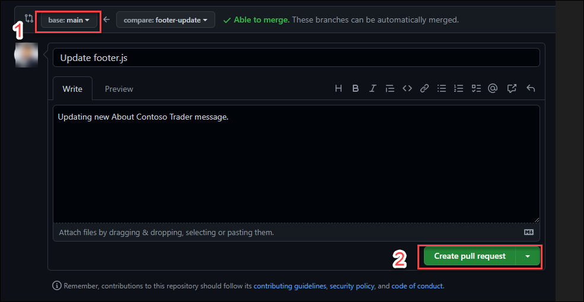

9. Merge the pull request to main branch.  

    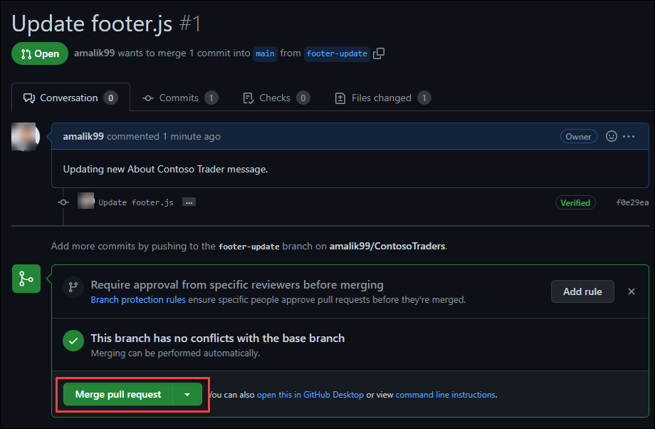

10. Merging the pull request should trigger your GitHub Action workflow, it will take few minutes for workflow to complete.  You can navigate inside the workflow to review progress, as documented in previous step.

    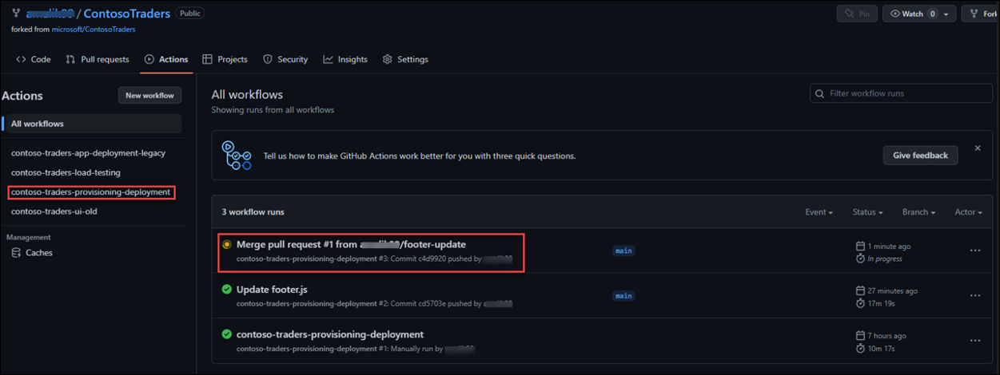
    
11. Once the workflow successfully completes, you can navigate to your Contoso Traders Instance and see that the footer is updated on website.

## Walkthrough – GitHub Advanced Security  

 
GitHub Advanced Security is a set of features and tools that help users secure their repositories and protect their code. Some of its features include: 

   - Dependency scanning: This feature automatically scans dependencies for known vulnerabilities and alerts users when a vulnerable package is detected. 
   - Code scanning: This feature uses static analysis to detect potential security vulnerabilities in the code itself, and provides alerts and recommendations for how to fix the issues. 
   - Access control: This feature allows users to set up granular permissions and access controls for their repositories, so they can control who can view, push, and manage code. 
   - Secret scanning: This feature automatically scans repositories for potential secrets, such as API keys or password strings, and alerts users if any are detected.
   - DDoS protection: This feature provides additional protection against distributed denial of service (DDoS) attacks, which can disrupt access to repositories and make them unavailable. 

These features can help users secure their repositories and protect their code from a variety of potential threats. 

Let us look at some of the GitHub Advanced Security features in action on your Contoso Traders Public Repo.  

## Overview

Contoso Traders is one of the leading E-Commerce platforms with a wide range of electronic products like desktops and laptops, mobile phones, gaming console accessories, and monitors. This includes a wide range of international brands like Microsoft Surface, XBOX, Samsung, ASUS, DELL etc. Contoso Traders Organization is using Microsoft 365 for their collaboration works internally.

Contoso Traders has different departments like marketing, sales, accounts, HR, and IT. For internal communication, they are using Microsoft Teams and Outlook. In the Contoso Traders organisation, there are various functionalities with the Contoso Traders E-commerce platform like product approval, product price approval, Product price update approval etc. 

## Context

You will explore the Contoso traders code base present in a GitHub repository which contains all the files related to the application’s UI, backend APIs, deployment files, GitHub workflows, and deployment guides. You will also explore about GitHub security features like Dependency graph and Dependabot. You will also explore Azure Defender for cloud and how it protects the rsoources

## Prerequisite

Before proceeding to next steps. The application and related resources should be deployed and configured. If not deployed, please follow the **Deployment** documentation to complete the deployment.

## Steps

1. Open browser, using a new tab and navigate to `https://www.contosotraders.com/` **(1)**. If you see `Your connection isn't private` warning then click on **Advanced** an select **Continue to contosotraders.com (unsafe) (2)**

   
   
1. The products are seperated based on different catagories like **Laptops**, **Controllers**, **Desktops**, **Mobiles**, and **Monitors**.   
      
         
   
1. Navigate to any category and select any of the product. You'll be able to see details like **technical description of the product**, **bank offers**, **Question and Answers** related to the product.

   
   
1. In a new browser tab open `https://www.github.com` and Log in with your personal GitHub account.

   **Note** : You have to use your own GitHub account. If you don't have a GitHub account then navigate to the following link `https://github.com/join` and create one.   
   
1. Open browser, using a new tab navigate to your forked **ContosoTraders** repo (`https://github.com/<GITHUB USERNAME/ContosoTraders`) GitHub repository. This repository conatins all the neccessary files and documents which will guide you to host the contoso traders application from the scratch.

   
   
1. 
