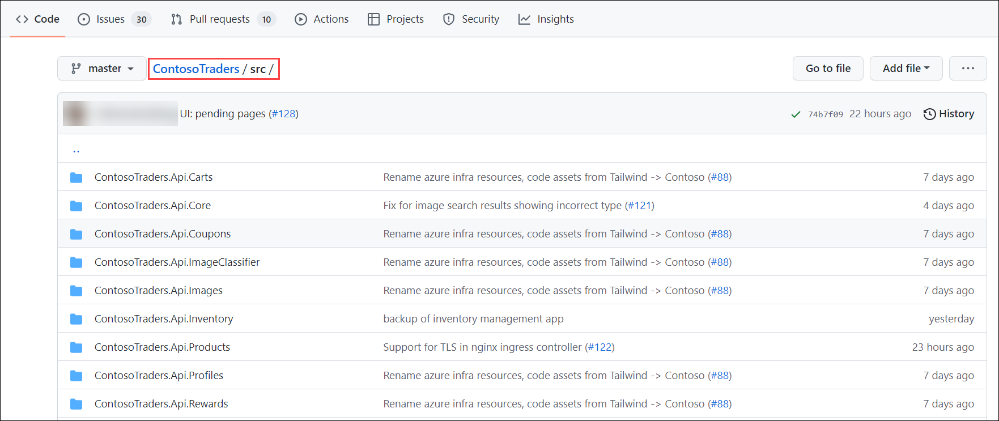
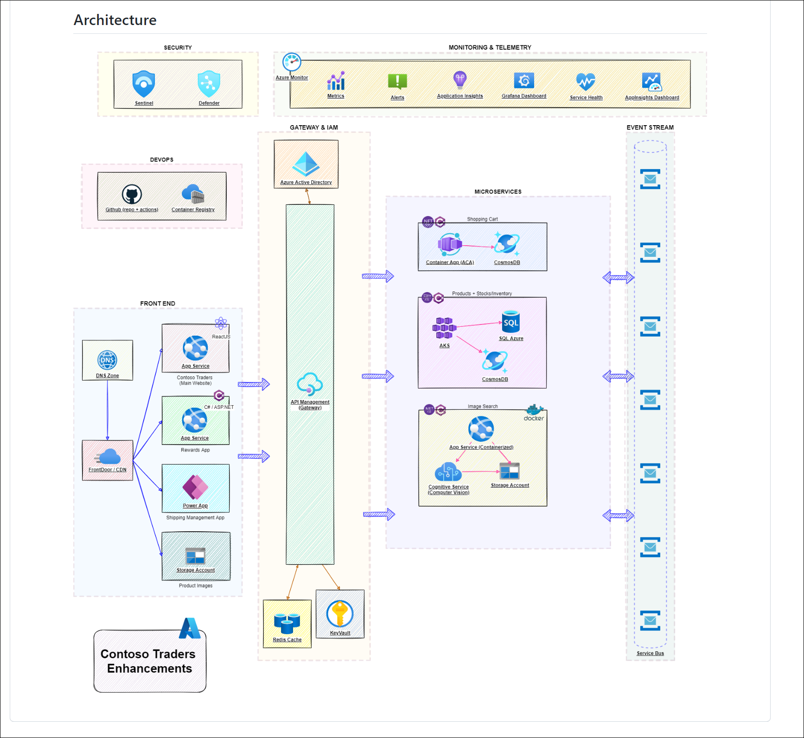

# DevSecOps: L100

## Overview of the Contoso Traders application

Contoso Traders is one of the leading E-Commerce platforms with a wide range of electronic products like desktops and laptops, mobile phones, gaming console accessories, and monitors. This includes a wide range of international brands like Microsoft Surface, XBOX, Samsung, ASUS, DELL etc. Contoso Traders Organization is using Microsoft 365 for their collaboration works internally.

Contoso Traders has different departments like marketing, sales, accounts, HR, and IT. For internal communication, they are using Microsoft Teams and Outlook. In the Contoso Traders organisation, there are various functionalities with the Contoso Traders E-commerce platform like product approval, product price approval, Product price update approval etc. 

## Key Takeaway

The key takeaways from this demo are: 

   - GitHub Actions is used to automate the deployment of the application and infrastructure. Using GitHub Action workflows, the application and infrastructure can be deployed to Azure cloud with a single click, allowing you to implement continuous integration and continuous deployment process.  
   - GitHub Actions integrates with Azure services to enable you to build, test, and deploy to Azure directly from your GitHub repository, along with tons of other integrations. 
   - GitHub Advanced Security is a set of tools that help you find and fix vulnerabilities in your code, protect your users, and detect and prevent malicious activity.
   - GitHub Advanced Security is available for public and private repositories on GitHub.com and GitHub Enterprise Cloud. 
   - GitHub Advanced Security can be integrated with Microsoft Defender for Cloud to provide a unified view of security alerts and vulnerabilities across the entire DevSecOps pipeline.

## Before you begin

   - No prerequisites are required for this specific demo. 

## Walkthrough – DevSecOps with Contoso Traders  

## Walkthrough – GitHub Actions for CI/CD 

 GitHub Actions is a way to automate processes and workflows in your GitHub repository. Some of the benefits of using GitHub Actions include the ability to automate your software development lifecycle, integrate with other tools and services, including Azure services. 

Let us take a look at the GitHub Actions used by Contoso Traders for CI/CD. 

## Review Workflows used in Contoso Traders 

1. Navigate to https://github.com/microsoft/ContosoTraders  

2. Go to the **github/workflows (1)** folder; inside, you'll find the workflow **YAML files (2)** that are used to deploy and set up the resources.  

    

3. Here is a quick overview of both workflows. If you are interested, you can review the workflow code to get into more details.  

    a. **Contoso-traders-provisioning-deployment:**  This workflow provisions Azure resources used for hosting the application and deploys the application and initial data to the provisioned resources. 

     It includes everything needed to get the application up and running in an Azure Environment.  

      

 
    b. **contoso-traders-load-testing:** This workflow runs a load testing against the ContosoTraders application using Azure Load Testing.  

       
      
     
## Monitor GitHub Actions Workflow

GitHub Actions workflows can be monitored from the Actions tab on a repository. This tab shows a list of all the active and past workflows, along with their status and any associated logs. Users can see at a glance whether their workflows are running successfully and can troubleshoot any issues that may arise. Additionally, users can set up notifications to be alerted when a workflow starts or completes, or if it encounters an error. This can help users stay on top of their workflows and ensure that their projects are running smoothly. 

Let us take a look at the workflows status for Contoso Traders in this public repository  

1. Navigate to https://github.com/microsoft/ContosoTraders/actions  

    
    
2. Select the workflow **contoso-traders-provisioning-deployment**. This will the history of workflows execution.  

    

3. Select the latest run from the list. In Summary, you will see 4 jobs listed. 

    - Provision-infrastructure: Used for provisioning Azure resources, configure access policies and permissions, seeding initial database. 
    - deploy-carts-api: Used to deploy the Carts API in Azure Container Apps.  
    - deploy-products-api: Used to deploy Products API service in Azure Kubernetes Service. 
    - deploy-ui: Used to deploy the front end website to Azure App Service.  

    

4. Click on **provision-infrastructure** job. You can now see detailed task of this job and expand to see the logs and steps.

   

  Similarly, you can review other jobs and workflows. Workflow are set to run on push to main branch, so that any new code change to main branch is automatically built and deployed. 
  
  
## Walkthrough – GitHub Advanced Security 

GitHub Advanced Security is a set of features and tools that help users secure their repositories and protect their code. Some of its features include: 

   - Dependency scanning: This feature automatically scans dependencies for known vulnerabilities and alerts users when a vulnerable package is detected. 
   - Code scanning: This feature uses static analysis to detect potential security vulnerabilities in the code itself, and provides alerts and recommendations for how to fix the issues. 
   - Access control: This feature allows users to set up granular permissions and access controls for their repositories, so they can control who can view, push, and manage code. 
   - Secret scanning: This feature automatically scans repositories for potential secrets, such as API keys or password strings, and alerts users if any are detected. 
   - DDoS protection: This feature provides additional protection against distributed denial of service (DDoS) attacks, which can disrupt access to repositories and make them unavailable. 

These features can help users secure their repositories and protect their code from a variety of potential threats. 

Let us look at some of the GitHub Advanced Security features in action on our Contoso Traders Public Repo.  

## Review Dependabot in Contoso Traders

Dependabot security updates make it easier for you to fix vulnerable dependencies in your repository. If you enable this feature, when a Dependabot alert is raised for a vulnerable dependency in the dependency graph of your repository, Dependabot automatically tries to fix it. 

Let us take a look at how dependabot is used in Contoso Traders.  Please note that GitHub Advanced security alerts are not public, so screenshots are included further. If you’d like to see this in action, please follow technical walkthrough for DevSecOps with Contoso Traders.  

1. Contoso Traders repository is enabled with GitHub Advanced Security features, including dependabot.  

2. Dependabot generates alerts for vulerablity, as demonstrated in below screenshot.  These vulnerabilities are not fixed intentionally to demonstrate the dependabot features.

    

### Launch the Contoso Traders application

You will launch the Contoso Traders application and explore its functionality.

1. Open browser, using a new tab navigate to `https://www.contosotraders.com/` **(1)**. If you see `Your connection isn't private` warning then click on **Advanced** an select **Continue to contosotraders.com (unsafe) (2)**

   
   
1. The products are separated based on different categories like **Laptops**, **Controllers**, **Desktops**, **Mobiles**, and **Monitors**.   
      
         
   
1. Navigate to any category and select any of the product. You'll be able to see details like **technical description of the product**, **bank offers**, **Question and Answers** related to the product.

     
   
### ContosoTraders GitHub repository

Now that you are aware about the Contoso Traders application, Let's explore and understand the files and directories present in ContosoTraders repository.
   
1. In a new browser tab open `https://www.github.com` and Log in with your personal GitHub account.

   **Note**: You have to use your own GitHub account. If you don't have a GitHub account, then navigate to the following link `https://github.com/join` and create one.   
1. Open browser, using a new tab navigate to your forked **ContosoTraders** repo (`https://github.com/<GITHUB USERNAME/ContosoTraders`) GitHub repository. This repository contains all the necessary files and documents which will guide you to host the Contoso Traders application from the scratch.

    

1. Navigate to **github/workflows (1)** folder, it contains the **workflow YAML files (2)** using which you can deploy and configure the resources. Each workflow has its own functionality.

    

1. The **docs** folder contains the deployment instruction files, which guide you to deploy the infrastructure and application.

   

1. The **iac** folders contain the BICEP templates, which deploy the infrastructure needed for the application.

    

1. The **src** folder contains all the source code files related to backend APIs, UI, and other parts of the application.

     

1. The **tests** folder contains the files related to load testing.

      

1. From the **code** tab, scroll down a little and you’ll find the **links (1)** to access the application. There are different links for test, production UI. You can also access the **deployment instructions (2)** files using the links provided in the documentation paragraph.

     

1. If you scroll a little bit more, you’ll visualise the entire application infrastructure diagram. The diagram explains how different Azure resources are integrated together and runs in a synchronised manner to ensure the smooth operation of the application.

   
   
1. Navigate to **github/workflows** folder, it contains the workflow YAML files using which you can the deployment resources. Each workflow has its own functionality.

      

1. **contoso-traders-provisioning-deployment.yml** will deploy the infrastructure into Azure which includes resource groups, resources, sets access policies to key vaults, and seeds the database from storage accounts into an Azure SQL database. It also deploys the application to Azure cloud. The application is configured to use the pre-deployed resources.

    

1. **contoso-traders-load-testing.yml** configures the load testing for the application.
  
   

1. From the GitHub repository, navigate to **Actions (1)** tab. You’ll see the different **GitHub workflows (2)** in the Actions sidebar. To run the workflow, select the workflow, click on **Run workflow (2)** and select **Run workflow (3)** to trigger the action.

     
   
 ### Version control 
 
In this walkthrough, you will explore GitHub version control and understand how it helps in retrieving the commits made in past.
   
1. From the **code (1)** tab, click on **commits (2)** button.

     
   
1. Here, you'll be able to see all the commit history of the GitHub repository.

       
   
1. click on any of the **Angle brackets** button. It will discard the latest commits after that particular commit and take you the state of the repository when the particular commit was merged.

        
   
   
   
### Explore GitHub Advance Security features  

In this walktrough, you will explore about Dependency graph, Dependabots, and understand it's implementation.
   
1. Navigate to **Settings (1)** tab, select **Code security and analysis (2)** tab. Here, **Dependency graph**, and **Dependabots** should be enabled.

    - **The dependency graph** contains all of a repository's dependencies as detailed in the manifest and lock files, or their equivalents, for supported ecosystems, as well as any dependencies submitted via the Dependency Submission API.
   
    - **Dependabot alerts** tell you that your code depends on a package that is insecure or malicious.   

    - **Dependabot security updates** creates alert for every vulnerable dependency identified in your full dependency graph. However, security updates are triggered only for dependencies that are specified in a manifest or lock file.
   
   
    
1. Navigate to **Security (1)** tab and select the **Dependabot (2)** from the side bar.

     
   
1. Select the **Improper Neutralization of Special Elements used in a Command in Shell-quote** alert.

   
   
1. Go through the alert description and click on **Review security update**.

   
   
1. You can **review (1)** the changes that will be made to resolve the alerts. By clicking on **Merge pull request (2)** button, you can resolve the alert. This is how you make the repository safer and eliminate the vulnerabilities.

   
   
### Microsoft Defender for Cloud

In this walkthrough, you will explore about Microsoft Defender for cloud and understand how you can secure your resources from vulnerabilities. You will also explore about Microsoft Defender for DevOps and understand how you can protect your GitHub repository from threats and vulnerabilities.
   
1. Now, sign in to your Azure account, where the Contoso Traders infrastructure is hosted. If the infrastructure is not deployed, please follow the **Deployment setup** documentation.

1. From the Azure portal, search for **Microsoft Defender for cloud (1)** from the search and select **Microsoft Defender for cloud (2)**.

   
   
1. From Microsoft Defender for cloud page, select **Environment settings (1)** tab from the sidebar and click on your **subscription (2)**      
      
   
   
1. In the Settings | Defenders page, you'll be able to see all the resources for which Azure Defender plan is enabled. These are resources which are protected by the Defender plan.
 
   - Azure Defender for cloud finds weak spots across your cloud configuration, helps strengthen the overall security posture of your environment.

      
   
1. Navigate back to Microsoft Defender for cloud page, select **Recommendations** from the side blade.

   
   
1. In the Recommendations page, select the **All recommendations (1)** tab. You'll be able to see a bunch of recommendations based on severity. 
 
    - Using the policies, Defender for Cloud periodically analyses the compliance status of your resources to identify potential security misconfigurations and weaknesses. It then provides you with recommendations on how to remediate those issues. Recommendations are the result of assessing your resources against the relevant policies and identifying resources that aren't meeting your defined requirements.

    
  
1. In the Recommendations page, scroll down a bit and you'll be able to see a set of recommendations for the protected resources and click on any of the recommendation to see the details.

    
  
1. Here, you can see the **Description** of the recommendation. Using **Remediation steps**, you can fix the vulnerability. Also you can check the affect**Affected resources**.

     
   
1. Navigate back to Microsoft Defender for cloud page, select **DevOps Security (preview)** from the side bar.

   
   
1. **Defender for DevOps** allows you to manage your connected environments and provides your security teams with a high level overview of discovered issues that may exist within the repository. Click on the **ContosoTraders** GitHub repository.

   
   
1. Select any one of the **Recommendations** from the list.

   
   
1. Take a look at the **Description** of the recommendation. Using the steps mentioned in the **Remediation steps**, you can take action and resolve the issue.

   
   
## Summary

You have understood and got an overview about the Contoso Traders website, GitHub repository, GitHub security features, and Microsoft Defender for cloud and DevOps.

    
