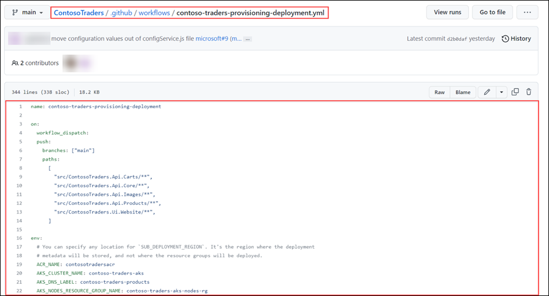
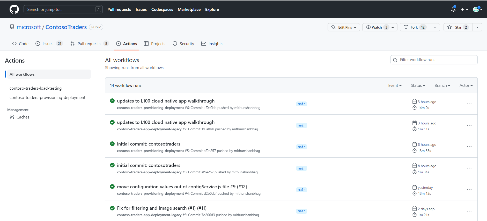
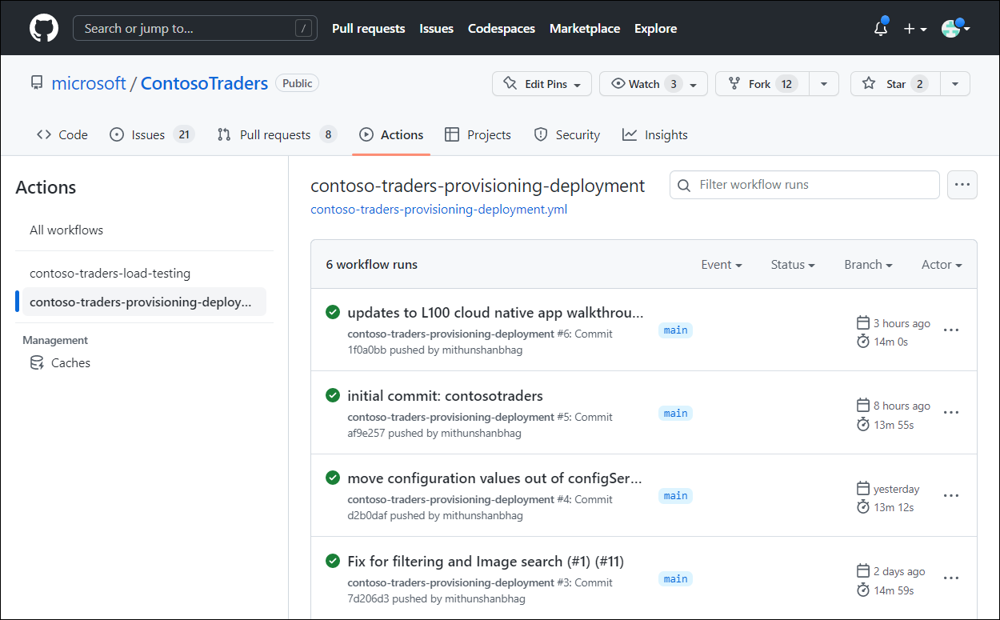
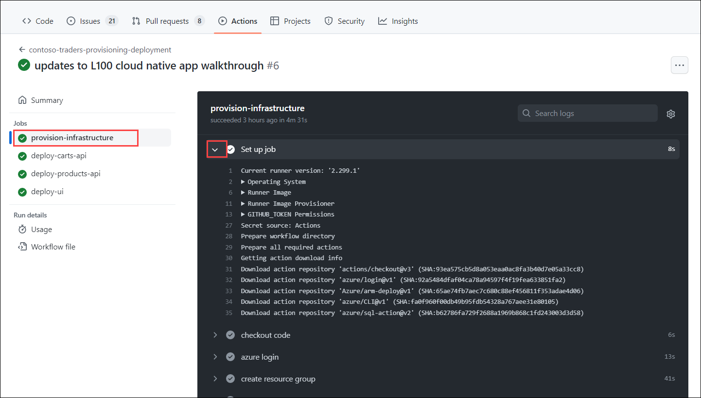
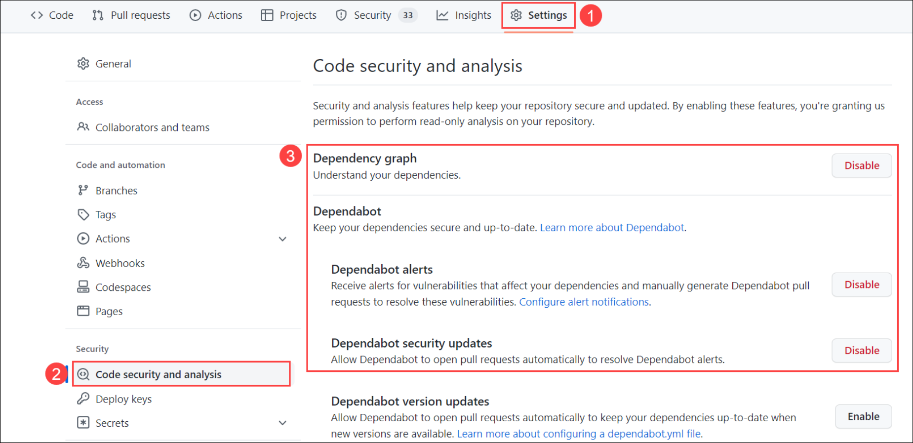
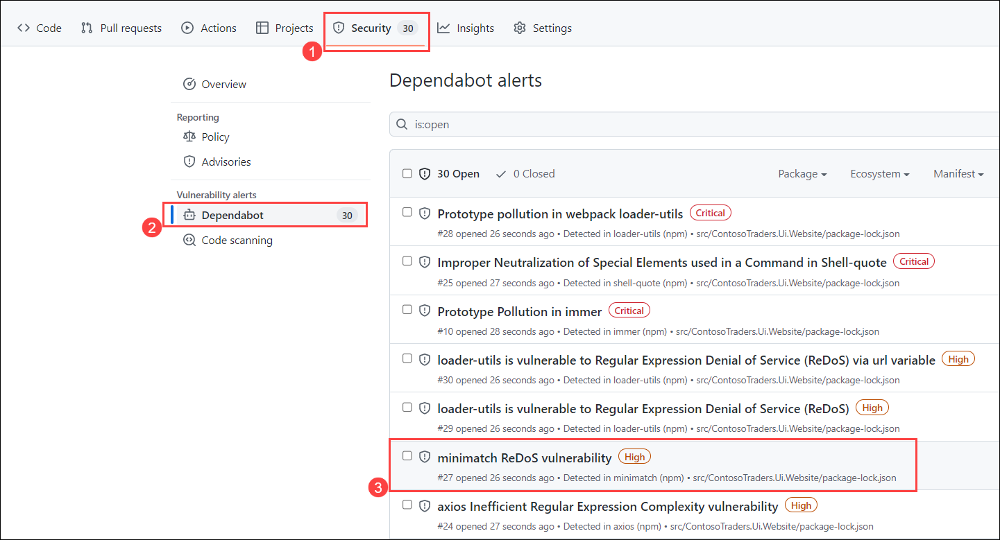
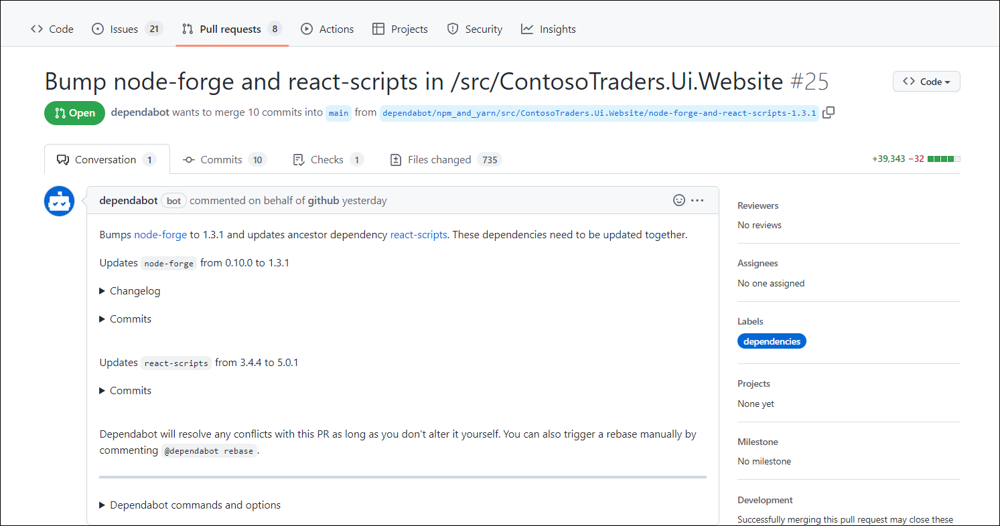
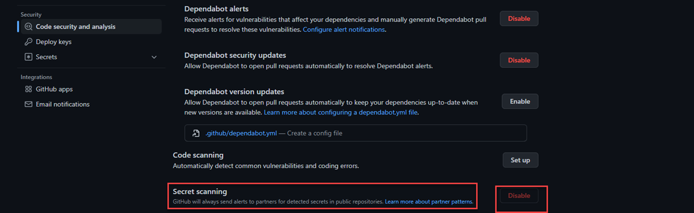

# DevSecOps: L100

# DevSecOps with GitHub & Azure: Overview  

## Key Takeaway

The key takeaways from this demo are: 

   - GitHub Actions is used to automate the deployment of the application and infrastructure. Using GitHub Action workflows, the application and infrastructure can be deployed to the Azure cloud with a single click, allowing you to implement continuous integration and a continuous deployment process.  
   - GitHub Actions integrates with Azure services to enable you to build, test, and deploy to Azure directly from your GitHub repository, along with tons of other integrations. 
   - GitHub Advanced Security is a set of tools that help you find and fix vulnerabilities in your code, protect your users, and detect and prevent malicious activity.
   - GitHub Advanced Security is available for public and private repositories on GitHub.com and GitHub Enterprise Cloud. 
   - GitHub Advanced Security can be integrated with Microsoft Defender for Cloud to provide a unified view of security alerts and vulnerabilities across the entire DevSecOps pipeline.

## Before you begin

   - No prerequisites are required for this specific demo. 

## Walkthrough – DevSecOps with Contoso Traders  

## Walkthrough – GitHub Actions for CI/CD 

 GitHub Actions is a way to automate processes and workflows in your GitHub repository. Some of the benefits of using GitHub Actions include the ability to automate your software development lifecycle and integrate with other tools and services, including Azure services. 

Let us take a look at the GitHub Actions used by Contoso Traders for CI/CD. 

## Review Workflows used in Contoso Traders 

1. Navigate to [ContosoTraders](https://github.com/microsoft/ContosoTraders) 

2. Go to the **github/workflows (1)** folder; inside, you'll find the workflow **YAML files (2)** that are used to deploy and set up the resources.  

    

3. Here is a quick overview of both workflows. If you are interested, you can review the workflow code to get into more details.  

    a. **Contoso-traders-provisioning-deployment:**  This workflow provisions Azure resources used for hosting the application and deploys the application and initial data to the provisioned resources. 

     It includes everything needed to get the application up and running in an Azure Environment.  

      

 
    b. **contoso-traders-load-testing:** This workflow runs a load testing against the ContosoTraders application using Azure Load Testing.  

      
      
     
## Monitor GitHub Actions Workflow

GitHub Actions workflows can be monitored from the Actions tab on a repository. This tab shows a list of all the active and past workflows, along with their status and any associated logs. Users can see at a glance whether their workflows are running successfully and can troubleshoot any issues that may arise. Additionally, users can set up notifications to be alerted when a workflow starts or completes, or if it encounters an error. This can help users stay on top of their workflows and ensure that their projects are running smoothly. 

Let us take a look at the workflows status for Contoso Traders in this public repository  

1. Navigate to [ContosoTraders/Actions](https://github.com/microsoft/ContosoTraders/actions) 

    
    
2. Select the workflow **contoso-traders-provisioning-deployment**. This will the history of workflows execution.  

    

3. Select the latest run from the list. In Summary, you will see 4 jobs listed. 

    - Provision-infrastructure: Used for provisioning Azure resources, configure access policies and permissions, seeding initial database. 
    - deploy-carts-api: Used to deploy the Carts API in Azure Container Apps.  
    - deploy-products-api: Used to deploy Products API service in Azure Kubernetes Service. 
    - deploy-ui: Used to deploy the front end website to Azure App Service.  

    

4. Click on **provision-infrastructure** job. You can now see the detailed task of this job and expand to see the logs and steps.

   

  Similarly, you can review other jobs and workflows. Workflow are set to run on push to the main branch so that any new code change to the main branch is automatically built and deployed. 
  
  
## Walkthrough – GitHub Advanced Security 

GitHub Advanced Security is a set of features and tools that help users secure their repositories and protect their code. Some of its features include: 

   - Dependency scanning: This feature automatically scans dependencies for known vulnerabilities and alerts users when a vulnerable package is detected. 
   - Code scanning: This feature uses static analysis to detect potential security vulnerabilities in the code itself, and provides alerts and recommendations for how to fix the issues. 
   - Access control: This feature allows users to set up granular permissions and access controls for their repositories, so they can control who can view, push, and manage code. 
   - Secret scanning: This feature automatically scans repositories for potential secrets, such as API keys or password strings, and alerts users if any are detected. 
   - DDoS protection: This feature provides additional protection against distributed denial of service (DDoS) attacks, which can disrupt access to repositories and make them unavailable. 

These features can help users secure their repositories and protect their code from a variety of potential threats. 

Let us look at some of the GitHub Advanced Security features in action on our Contoso Traders Public Repo.  

## Review Dependabot in Contoso Traders

Dependabot security updates make it easier for you to fix vulnerable dependencies in your repository. If you enable this feature, when a Dependabot alert is raised for a vulnerable dependency in the dependency graph of your repository, Dependabot automatically tries to fix it. 

Let us take a look at how dependabot is used in Contoso Traders.  Please note that GitHub Advanced security alerts are not public, so screenshots are included further. If you’d like to see this in action, please follow technical walkthrough for DevSecOps with Contoso Traders.  

1. Contoso Traders repository is enabled with GitHub Advanced Security features, including dependabot.  

2. Dependabot generates alerts for vulnerability, as demonstrated in the below screenshot.  These vulnerabilities are not fixed intentionally to demonstrate the dependabot features.

    
    
3. Let us look at  **minimatch ReDoS vulnerability** . As you can see in screenshot it includes  details about vulnerability and suggested upgrade version.

    

   GitHub Dependabot can also raise pull request automatically based on vulnerability detected along with selected versions. Let us take a look at one such pull request raised by dependabot
   
   
4. Navigate to one search pull request example [Pull request](https://github.com/microsoft/ContosoTraders/pull/25).

5. You can see the PR raised by dependabot automatically fixing the vulnerability by upgrading node-forge from 0.10.0 to 1.3.1 and react-scripts from 3.4.4 to 5.0.1

    

## Review Secret Scanning in Contoso Traders 

 
GitHub scans repositories for known secret formats to prevent fraudulent use of credentials that were committed accidentally. Secret scanning happens by default on public repositories and can be enabled on private repositories by repository administrators or organization owners. 

 Contoso Traders is set to have secret scanning enabled for the public repository. Please note that GitHub Advanced security secret scanning alerts are not public, so screenshots are included further. If you’d like to see this in action, please follow technical walkthrough for DevSecOps with Contoso Traders. 
 
 You will notice that Secret Scanning is already enabled. GitHub enables secret scanning by default for all Public repo. If you have a private repo, you can manually enable it from this page.
 
   

 
## Microsoft Defender for Cloud with GitHub Advanced Security  

Microsoft Defender for Cloud is a Cloud Security Posture Management (CSPM) and Cloud Workload Protection Platform (CWPP) for all of your Azure, on-premises, and multicloud (Amazon AWS and Google GCP) resources. 

Microsoft Defender integrates with GitHub Advanced Security to provide and end to end DevSecOps solution.  

By connecting your GitHub repositories to Defender for Cloud, you'll extend Defender for Cloud's enhanced security features to your GitHub resources. These features include: 

   - **Defender for Cloud's Cloud Security Posture Management (CSPM) features** - Assesses your GitHub resources according to GitHub-specific security recommendations. You can also learn about all of the recommendations for DevOps resources. Resources are assessed for compliance with built-in standards that are specific to DevOps. Defender for Cloud's asset inventory page is a multicloud enabled feature that helps you manage your GitHub resources alongside your Azure resources. 
   - **Defender for Cloud's Cloud Workload Protection features** - Extends Defender for Cloud's threat detection capabilities and advanced defenses to your GitHub resources. 

If you’d like to see this in action, please follow technical walkthrough for DevSecOps with Contoso Traders. 

## Summary 

In this scenario, we looked at how GitHub Actions and Advanced Security features can help organizations build an effective DevSecOps process, enhancing overall productivity and security posture of software development lifecycle. 

If you are interested in a technical walkthrough with steps, please follow the technical walkthrough documentation.  

## Additional Reading  

### Reference Links  

  - [DevSecops in GitHub](https://learn.microsoft.com/en-us/azure/architecture/solution-ideas/articles/devsecops-in-github)
  - [GitHub Features and Actions](https://github.com/features/actions)
  - [GitHub advanced security](https://docs.github.com/en/get-started/learning-about-github/about-github-advanced-security) 
