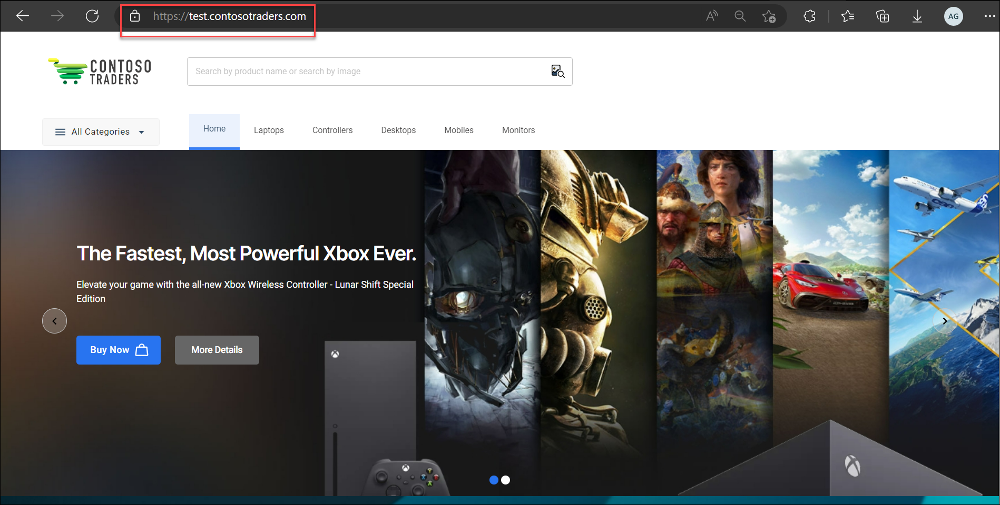
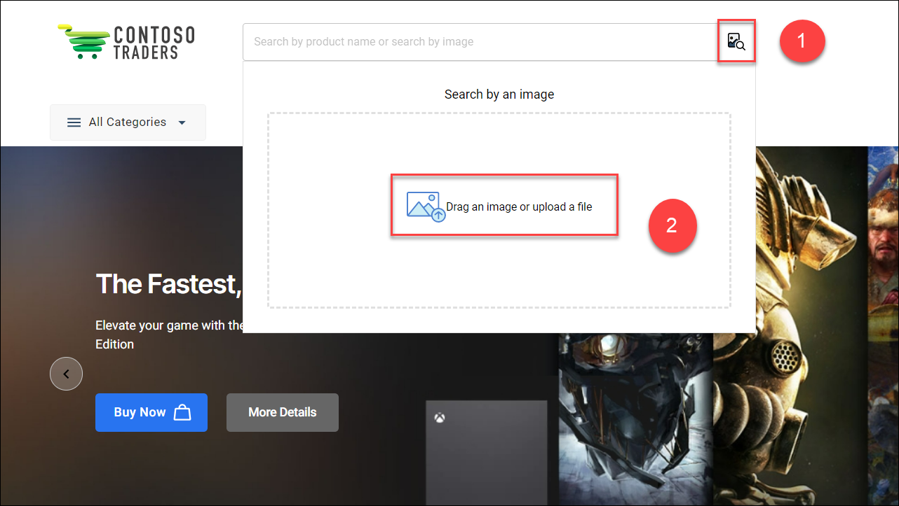
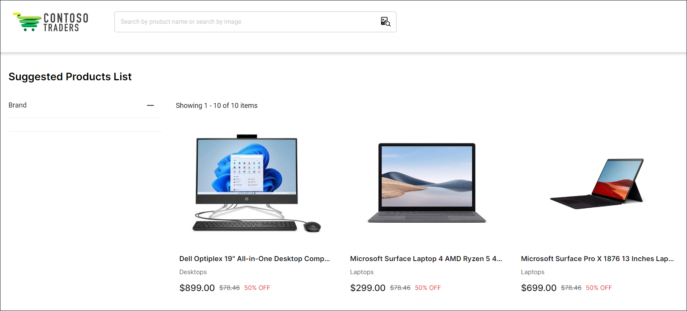

# Intelligent Apps with Azure AI Services - L100

Lab time: 5 minutes

## Overview of the Contoso Traders application

Contoso Traders is a fictitious company that sells a wide range of products. The company has a website that allows customers to browse products and add them to their shopping cart. The website also allows customers to search for products by name or category. The website is hosted in Azure and uses a variety of Azure services to provide the functionality.

In this demo script, we will explore how to use Azure AI services to enhance the Contoso Traders application. We will start by launching the application and giving an overview of the app with a focus on the need for AI/Visual Search. We will then search for a product through an image. Finally, we will explore the AI services used in the app and how/where they are hosted.

## Launch the Contoso Traders application

* Open a browser and navigate to the Contoso Traders website: [https://www.contosotraders.com](https://www.contosotraders.com)

  

  On the webpage, you will be able to see the e-commerce store with clusters of electronic products such as laptops, game controllers, desktops, mobile phones, and monitors of different brands.

## Search for a product through an image

* Select the `Search Image` icon in the right of the search bar and click on `Drag an image or upload a file`.

   

* Upload an image ([example](./media/laptop-example.jpg)) and click `Open`. This will take you to the `Suggested Products List` page as per the image provided to search and you can select the product you wish to buy from here.

   

## Overview of Azure AI services used

The Contoso Traders application uses the `Azure Cognitive Services` (Computer Vision API) to analyze images and return a list of suggested products. The `Computer Vision API` is a cloud-based service that provides developers with access to advanced algorithms for processing images and returning information. The API can be used to find recognize objects, items and faces in an image. It can also be used to analyze the text in an image. In our case, the API is used to analyze an image and return a list of products that are similar to the image.

For more technical details, please see our [technical walkthrough document](./technical-walkthrough.md).

## Reference Links

* [Cognitive Services Overview](https://learn.microsoft.com/en-us/azure/cognitive-services/computer-vision/overview)
* [Computer Vision](https://learn.microsoft.com/en-us/azure/cognitive-services/computer-vision/overview)
