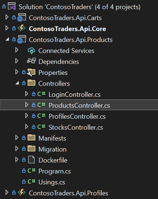
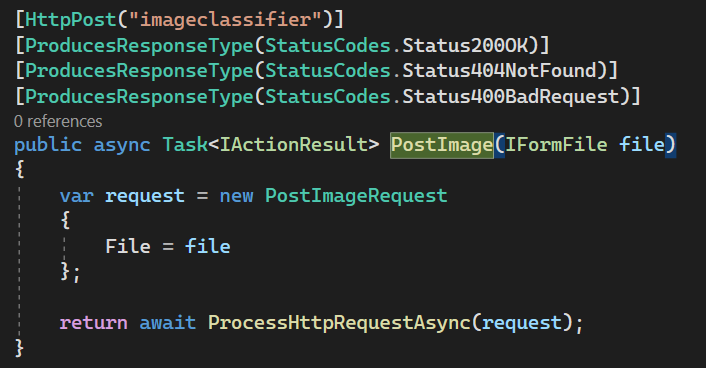
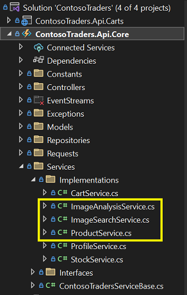
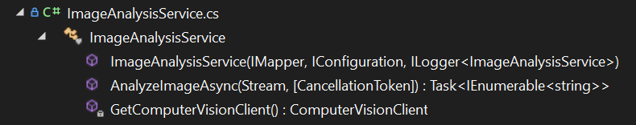
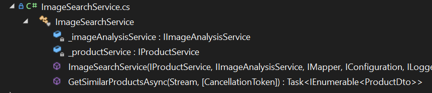
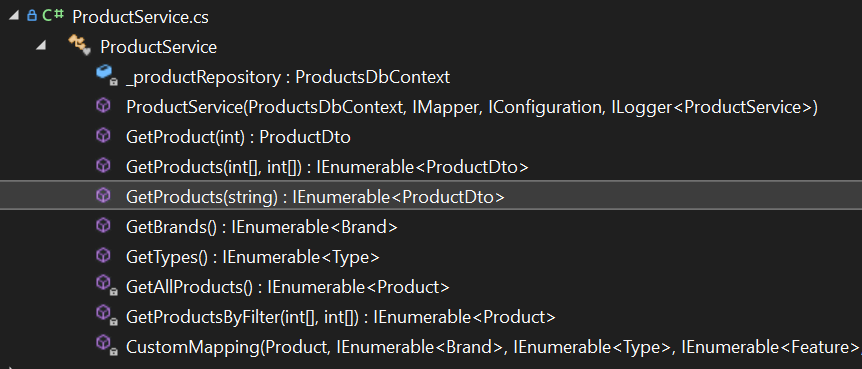

# Intelligent Apps with Azure AI Services - Technical Walkthrough

## Overview of the Contoso Traders application

Contoso Traders is a fictitious company that sells a wide range of products. The company has a website that allows customers to browse products and add them to their shopping cart. 

## Key Takeaways

* Azure AI Services is a suite of tools and services offered by Microsoft Azure that allows developers to incorporate intelligent features into their applications. With Azure AI Services, developers can easily add these intelligent features to their applications without the need for specialized knowledge or expertise in the field of artificial intelligence.

* Cognitive Services image search is a feature of Azure AI Services that allows developers to incorporate image recognition capabilities into their applications. This service uses machine learning algorithms to analyze and understand the content of images, making it possible for applications to search for and retrieve images based on their visual characteristics.

* You will have understanding of how Contoso Traders is leveraging Azure Cognitive Services to faclitate image based search.

## Abstract and learning objectives

In this lab, you will explore the [Contoso traders application](https://www.contosotraders.com/) and will go through the overview of an app with a focus on the need for AI/Visual Search, use the image search option in the application to find the device from the product catalog, learn how the **Azure AI service** is used in the application and also the high-level idea of how the Cognitive services work.

For this, we use the service called **Computer Vision**, an Azure AI service that analyzes content in images and videos.

Azure's Computer Vision service gives you access to advanced algorithms that process images and return information based on the visual features you're interested in such as **Optical Character Recognition (OCR**), **Image Analysis**, **Face Service** and **Spatial Analysis**.

With the Analyze Image API, Computer Vision can analyze content type of images, indicating whether an image is clip art or a line drawing.

## Before you begin

You will need the following pre-requisites to get started:

* Microsoft Azure Subscription with required permissions. You can [create one for free](https://azure.microsoft.com/en-us/free/ai/)
  
* [A resource of Cognitive Services for Computer vision](https://portal.azure.com/#create/MicrosoftCognitiveServicesComputerVision)

* [Vision Studio website](https://portal.vision.cognitive.azure.com/)

## Walkthrough(Step-by-step guidance)

1. Open the browser and navigate to [www.contosotraders.com](https://www.contosotraders.com/)

   

   On the webpage, you will be able to see the e-commerce store with a cluster of electronic products such as Laptops, Xbox controllers, Desktops, mobile phones, and monitors of different brands.

1. Select the **SerachImage (1)** icon in the right of the search bar and click on **Drag an image or upload a file (2)**.

   

1. Either download an image from a browser and save it or select a locally existing image and click **Open**. This will take you to the **Suggested Product list** page as per the image provided to search and select the product you wish to buy from the application.

   

   The **cloud-based Computer Vision API** provides developers with access to advanced algorithms for processing images and returning information. By uploading an image or specifying an image URL, Microsoft Computer Vision algorithms can analyze visual content in different ways based on inputs and user choices.

   The **Image Analysis service** extracts many visual features from images, such as objects, faces, adult content, and auto-generated text descriptions, it provides you with AI algorithms for processing images and returning information on their visual features.

   We can use **Vision Studio** to understand the process of Image Analysis in cognitive service using Computer Vsion features.
**Vision Studio** is a set of UI-based tools that lets you explore, build, and integrate features from Azure Computer Vision.
Vision Studio provides you with a platform to try several service features and sample their returned data in a quick, straightforward manner. Using Studio, you can start experimenting with the services and learning what they offer without the need to write any code. Then, use the available client libraries and REST APIs to get started embedding these services into your applications.

1. Sign in to [Vision Studio](https://portal.vision.cognitive.azure.com/) from browser with your Azure subscription and if it's your first time logging in, you'll see a popup window appear that prompts you to **Sign in to Azure** and then choose or create a Vision resource. You have the option to skip this step and do it later.
   
  
1. Select the **Subscription** dropdown, select the available subscription and then select an existing resource within your subscription under the **Azure Resources** option. If you'd like to create a new one, select Create a new resource.
   

1. If you have selected *Create a new resource* then enter information for your new resources, such as a name, subscription, resource group, Cognitive service resource type, location, and the pricing tier as below, and click **Create resource**.

   

1. Once the resource is created, you'll be able to try Image Analysis offered by Vision Studio.

    

1. Select the Analyze images tab, and select the panel titled **Extract common tags** from images.

    

1. Select an image from the available set, or upload your own.

1. After you select your image, you'll see the detected tags appear in the output window along with their confidence scores.

  
  
  You can also select the JSON tab to see the JSON output that the API call returns.

   

   You can analyze images to provide insights into their visual features and characteristics. Image Analysis offers the ability to extract text from images. **OCR** traditionally started as a machine-learning-based technique for extracting text from in-the-wild and non-document images like product labels, user-generated images, screenshots, street signs, and posters. For several scenarios that include running OCR on single images that are not text-heavy, you need a fast, synchronous API or service. This allows OCR to be embedded in near real-time user experiences to enrich content understanding and follow-up user actions with fast turn-around times.

1. On **Vision Studio** page, navigate back to **Featured** tab and select **Extract Text from Image**.

1. Drag and drop any image which contains text, and you'll see the detected text appear in the output window.

    

1. You can also select the JSON tab to see the JSON output that the API call returns.

    

    There are a few key concepts to understand how Image Analysis works on Azure, for example, Image Analysis can return content tags for thousands of recognizable objects, living beings, scenery, and actions that appear in images. Tags are not organized as a taxonomy and do not have inheritance hierarchies. A collection of content tags forms the foundation for an image description displayed as human-readable language formatted in complete sentences. When tags are ambiguous or not common knowledge, the API response provides hints to clarify the meaning of the tag in the context of a known setting.

    After you upload an image or specify an image URL, the Analyze API can output tags based on the objects, living beings, and actions identified in the image. Tagging is not limited to the main subject, such as a person in the foreground, but also includes the setting (indoor or outdoor), furniture, tools, plants, animals, accessories, gadgets, and so on.

    The next one is that Computer Vision can analyze an image and generate a human-readable phrase that describes its contents. The algorithm returns several descriptions based on different visual features, and each description is given a confidence score. The final output is a list of descriptions ordered from highest to lowest confidence and this is called **Image description generation**.

    **Object detection** is similar to tagging, but the API returns the bounding box coordinates (in pixels) for each object found in the image. For example, if an image contains a dog, cat, and person, the Detect operation will list those objects with their coordinates in the image. You can use this functionality to process the relationships between the objects in an image. It also lets you determine whether there are multiple instances of the same object in an image.

    The object detection function applies tags based on the objects or living things identified in the image. There is currently no formal relationship between the tagging taxonomy and the object detection taxonomy. At a conceptual level, the object detection function only finds objects and living things, while the tag function can also include contextual terms like "indoor", which can't be localized with bounding boxes.

   For more, refer this link: [Categorizing Images with  Azure Computer Vision](https://learn.microsoft.com/en-us/azure/cognitive-services/computer-vision/concept-categorizing-images)

1. To see how this is implemented in code, clone the [ContosoTraders GitHub repository](https://github.com/microsoft/ContosoTraders.git) in Visual Studio IDE.

1. The controller used for the image upload is in ProductsController. In the solution, go to ContosoTraders.Api.Products/Controllers
   

    The api endpoint used here is `imageclassifier`

    

1. To see the implementation part in the solution, go to ContosoTraders.Api.Core/Services/Implementations
   

Here you can see the 3 services, which facilitates the image categorization feature using Computer Vision.

* **ImageAnalysisService**: This service has two functions.
  
  
  * It facilitates the Custom Vision Client for the application using a Cognitive Services Account Key and Endpoint
  * The uploaded image stream is sent for analysis so that matching tags could be found.
  
* **ImageSearchService**: This service gets the image stream and sends it to the ImageAnalysisService to get the matching tags. Once it gets the matching tags, it uses ProductsService to find products in ProductsDB which contain words in the tags. A collection is retrieved for matching products, which is then filtered to get distinct products.
  
  
  
* **ProductService**: This is the all purpose service to access ProductsDB. For Image Categorization, GetProducts() from this service is used in ImageSearchService to recursively search for matching products from the tags returned from ImageAnalysisService.
  
  
  
* ## Summary

You have got an overview of Azure AI Services, understood in detail about Computer Vision and seen it in action on Contoso Traders website.

## Cleanup

1. Within the Azure portal, select Resource Groups on the left navigation.

2. Delete the resource groups created by selecting them, followed by the Delete resource group button. You will need to confirm the name of the resource group to delete.
