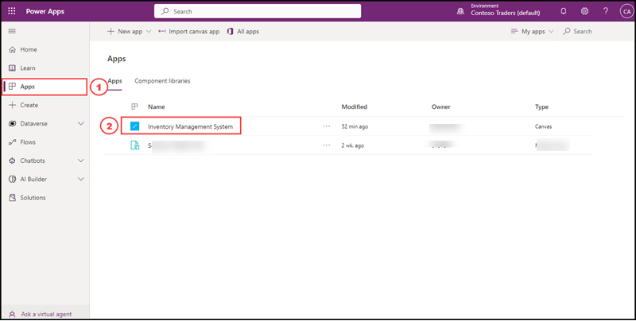
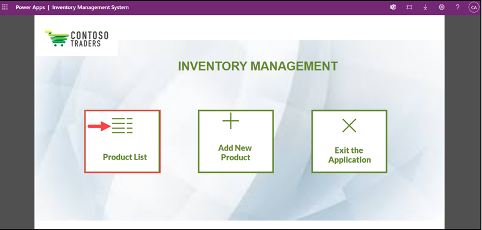
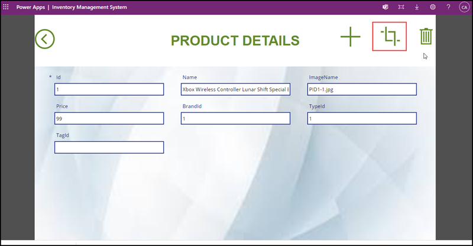
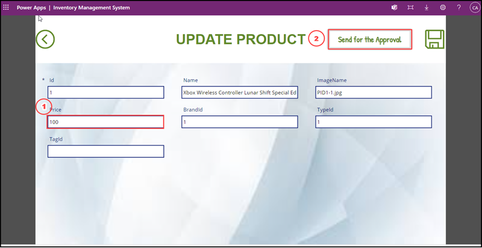
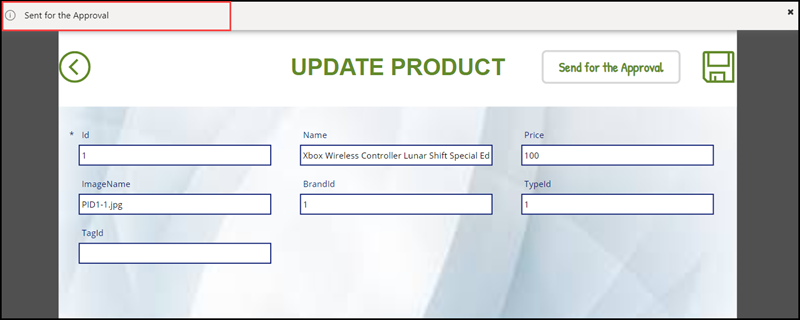
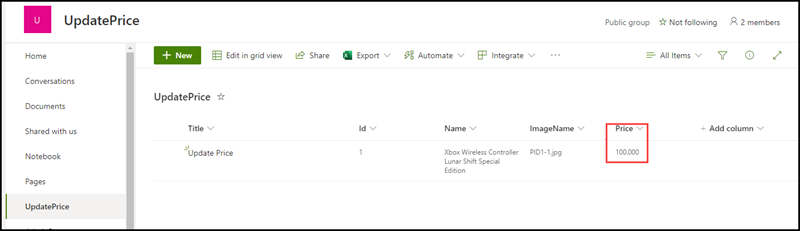

# Inventory Management System with Microsoft Power Platform

## Key Takeaway

The key takeaways from this demo are:

* Microsoft Power Platform is a collection of software tools and services that allow businesses to create custom applications and automate processes. The Power Platform includes Power BI, Power Apps, and Power Automate. These tools can be used to build a wide range of solutions, from simple data visualization dashboards to complex workflow automation systems. Some common use cases for the Power Platform include creating custom business applications, automating business processes, and creating dashboards and reports to gain insights into business data.

* Microsoft Power Platform integrates seamlessly with Microsoft 365 technologies such as Teams and Outlook. This integration allows businesses to leverage the power of the Power Platform to build custom solutions that extend the capabilities of these tools. For example, users can create custom apps using Power Apps that can be used within Teams to automate and streamline common business processes. Additionally, Power Automate can be used to integrate with Outlook to automatically process and route emails based on pre-defined rules, helping to improve productivity and efficiency. This integration allows businesses to take full advantage of the capabilities of the Power Platform to drive digital transformation within their organization.

* Contoso Traders leverages Power Apps, Power Automate and Microsoft Teams to implement an end to end inventory management system including approval workflows. 

## Problem Statement(s):
Contoso Traders are one of the leading E-Commerce platform with wide range of electronic products like Desktops and Laptops, Mobile Phones, Gaming console accessories and Monitors. 

Contoso Traders has different departments like Marketing, Sales, Finance, HR and IT, colloborating with Microsoft Teams and Outlook. 

Contoso Traders internal teams wants to avoid manual process for product updates in website and would want to leverage Microsoft Power Platform to build an internal inventory management system without having to do custom development. 

* In Contoso Traders for internal and external workflows collaborations there are several processes going on for different database transactions. A new product need to add into the product database, updating price of a product or deleting a product from the database, Contoso Traders depends on Microsoft 365 email and Teams for the internal collaborations.
* In the current approval process, the approvers (managers) getting the approval notifications in their emails and its difficult to find which category of item is getting approved, also need to check the product details manually and which team member sending the approval request and the details of the request. Also, its difficult for the users to send emails to the approver when the price of a product change happens. Once the approver approved the request and sent back the notifications to the users, users should update the price manually in the system.
* When the Finance Team wants to change the price of a product and get it approved from the approver, they are following manual approval process over email.. At the same time, multiple teams sending the request for updating the price, the approver find it difficult to view all the request notifications in the email, also the details of the product and the requester. In the current scenario there are so much mismatch happens when the price changes of different products happens.
* Approver needs to view the product details and the requestor before approving the price change of any product. Also when the approver approved the request the change of the price of that particular product should update automatically in the website as well as the database.

## Solutions

* Microsoft 365 is the collaboration platform for business users. Microsoft 365 offers different applications like Microsoft Office, Outlook, Teams, Power Platform, SharePoint etc. To resolve the issues in the current scenario, Contoso Traders decided to build an app in power platform  by using MS Cloud services like, Teams, cosmos etc., allowed to implement an end to end solution which’d update price on final website (contosotraders.com) with zero manual efforts from engineering/other teams and is fully automated with approval process in place. 
* PowerApps allows us to build custom apps, to accommodate our business needs or solve our issues when we cannot find a suitable off-the-shelf solution. PowerApps can easily connect to our stored business data, which is either located in Microsoft Dataverse or within an on-premise/online data source, for example; Excel, SharePoint, Office 365, SQL Server and Dynamics365. Also service in the Power platform  named Power Automate  can use for creating workflows to automate our processes.
* Created a custom Power App named Inventory Management System along with Power Automate workflow. This Inventory Management System App helps business users to easily update the price of a product by taking the approval from the stakeholders.
* When a business user send the approval request for updating the price of a particular product to the Approver through the Inventory Management App, a request will trigger in Microsoft Teams channel and the stakeholder can view the request and open the view items in the request to view the product details to be updated. When the stakeholder approves the request, business user can view it at the same time on the same Teams channel and the price will update in the website as well as database automatically. When the approver rejects the request business user can view the message at the same time.

## Before you begin

You must have Inventory Management System App deployed in your Power platform environment. If you have not deployed it yet, please refer the [documentation](../docs/Inventory-power-app-deployment-guide.md).
 
## Walkthrough - Inventory Management System App

   Now, Let us try the Inventory Management System App for Contoso Traders. We are going to launch the App and make  pricing updates on XBOX Controllers.

1. Please login into your Power Apps platform with your Microsoft 365 account.

2. To launch the App go to the Apps tab and Click on Inventory Management System

   
       
      
3. You are now in Inventory Management application. Please click on Product List. 
	
   

4. On Product List page, you can scroll through products or you can search by name in the search box. Click on "XBOX Wireless Controller Lunar Shift Special Edition".	

   
	
5. You can now see the product details, Click **update**. 

   
	
6. Update the price to 100 and click on **Send for the Approval**

   
	
7. You will receive a message stating that the price change is sent for approva.

   

8. Approval request is sent to stakeholders. Let's login into Microsoft Teams as Inventory Manager and navigate to Contoso Traders Inventory > Pricing Updates channel

   
	
10. When you enter into the channel mentioned above, review the price change request and click on view items, you can see the product details and changes in SharePoint. 

   
	
11. Once you are ready, you can approve the price change. This will send a message “Approved” in the same channel and also updates the price in the Azure SQL database. You  will receive another message in the Teams channel “Price Updated” once the process is completed.

   
	
12. You can see the Updation of the price in the Website also by navigating to your Contoso Traders website, as demonstrated in screenshot below.

   
	
## Summary

In this scenario, we looked at how Inventory Management System App successfully automated the process of updating and manage product pricing for Contoso Traders. 

If you are interested in a technical walkthrough with steps, please follow the technical walkthrough [documentation](./technical-walkthrough.md)

## Additional Resources

[Getting started with Canvas App](https://learn.microsoft.com/en-us/power-apps/maker/canvas-apps/getting-started)

[Power Automate Overview](https://learn.microsoft.com/en-us/training/modules/introduction-power-automate/)

[Adaptive Card for Teams](https://learn.microsoft.com/en-us/power-automate/overview-adaptive-cards)

	
