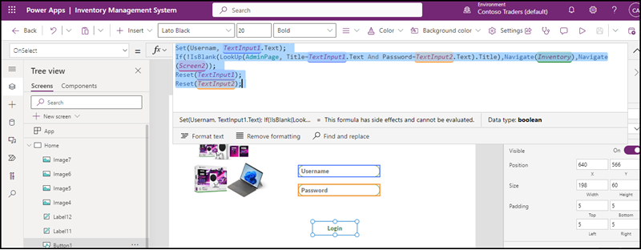

# Inventory Management System with Power Platform - Technical Walkthrough

Power platform helps to build the Inventory Management System App for resolving the issues in the current scenario of Contoso Traders. It enables the collaborations internally. Two main components of Power Platform were used to build the application viz, PowerApp and Power Automate. Let's walkthrough each component and how it's configured. 

## Key Takeaways

The Key takeaways from this demo are: 

* Power Platform is a suite of low-code and no-code tools that makes it easy for users with little or no technical expertise to build custom applications.
* The platform includes tools such as PowerApps, Power BI, and Power Automate etc, which can be used to quickly create and customize business solutions.
* PowerApps allows users to create custom applications using pre-built templates and drag-and-drop tools, while Power BI provides a range of visualization options for presenting data.
* Microsoft Power Automate allows users to automate business processes and connect different applications and services, simplifying common tasks and reducing the need for manual intervention.

Overall, Power Platform makes it easy for users to create custom internal applications without the need for specialized development skills.

## Before you begin

You must have Inventory Management System App deployed in your Power platform environment. If you have not deployed it yet, please refer the [documentation](../docs/Inventory-power-app-deployment-guide.md).

## Walkthrough: Solution Overview

This section has already been covered in our previous overview document. You can refer to it [here](./overview.md).

## Technical Walkthrough - Power App 

Inventory Management System App was built in Canvas App by using cloud database connectivity. Databases are kept in Azure SQL Database. We can use the app for CRUD operations. In Contoso Traders they need the Update operation through an automation process, before updating the price of any product the stakeholders should approve and once it gets approved the price will be updated automatically. Based on this scenario the App has to be built. Let's go through some of the screens in detail and explore how it's configured and what scripts and formulae are applied.    
  
      
1. Login into the Power platform Admin Center (https://admin.powerplatform.microsoft.com) with your Microsoft 365 Global Administrator account. 

2. Select the environment where you have deployed Inventory Management System App.

3. Select Apps and Select Inventory Management App, then click on Edit from the top side.

   

4. This will launch Power app studio where you can see the application screens, the details of connections and the workflow.

5. Select the first screen named Inventory, select the list icon and on the left top side from the dropdown list, select **OnSelect** and see the formula added. This helps users in navigating to products page. 
   

6. Product List screen will show all the products in a vertical gallery. Select the vertical gallery and on the left top side Select Items from the dropdown list and see the formula added there. This formula will list the entire data from the table Products of the Azure SQL database productsdb. Also a user can search the product by its name on the search box.

   

7.Select the Onselect of the Vertical gallery in the same screen to review the configuration. A variable is created which stores the value of item selected by the user from the gallery. It will also help navigate to ProductDetails screen.

      
  
8. On the Product Details Screen select the form, then select Item property from the dropdownlist on the top left side. This formula is for displaying the selected item stored from the variable.

  

  
9. Select the ProductDetails screen select update icon, then select onselect property from the dropdown on the top left side, see the formula. This formula is for navigating to the Update screen.
   
   

      
10. On the Update screen select “Send for Approval” button, You will see that it's triggering “Adaptiveworkflow1” which will update the price into SharePoint list named “UpdatePrice”.
       
   
    
       
 11. After clicking on the “Send for the Approval” button, it will trigger a notification message of Approval request into Microsoft Teams channel named "Pricing Updates" on the Teams named “Contoso Traders Inventory”. It has been configured by using Adaptive cards.

          
  
       
 12. In this Approval request Adaptive card we can see three buttons, one is to View Items, when the stakeholder click on view item it will redirect to a SharePoint list having the details of the product to be updated. The other two buttons are to Approve and Reject. When the Stakeholder clicks on Reject it will pass a message in the channel “Rejected”. When the stakeholder clicks on Approve it will pass a message in the channel “Approved” and immediately another message will come “Price updated”.
       
   
       
 Also it will automatically update the price in SQL Database, resulting in updated price on Contoso Traders Website.

## Walkthrough - Power Automate

Let’s take a look at Power Automate workflow named “Adaptiveworkflow1”. Here the requirement is when a business user is trying to update the price of any product, it should automate an approval request to a Teams Channel so that the stakeholder can approve/reject the price changes. 

1. Review the instant cloud workflow, as demonstrated in below screenshot.

   
        
In this workflow three variables are initialized with values submitted by, submitted on and an update T-SQL query respectively.
           
   
   
   
        
After that it uses the component “Post an Adaptive card and wait for response” flow. In this component, adaptive card configuration is supplied in JSON format along with parameter values. 

** If you are intrested, you can deep dive into the adaptive card json file [here](../iac/Adaptivecard.json).** 

After that a Condition control flow is configured with a condition body(‘PostAdaptiveCardToChannelAndWaitforaresponse’)[‘submitActionId’] to check for approval status. Along with the condition If Yes and IF No flows are also configured. When the stakeholder clicks on the Approve button then the If yes flow will execute. It has additional three flows added. Two flows are for passing the message on the Teams channel and One flow is for calling the variable having T-SQL update query. This will trigger the SQL query execution upon sucessful approval. 

    
  
    
Incase of rejection, the flow is set to update Teams Channel with "Rejected" message. 

  

## Summary

With Power platform tools any complex business scenarios can be configured and deployed easily. The Power Platform offers several benefits, including:

* Low-code and no-code tools: Power Platform tools, such as PowerApps and Microsoft Flow, are designed to be easy to use, even for users with little or no technical expertise. This allows organizations to empower their non-technical staff to build custom applications and automate business processes without the need for specialized development skills.

* Rapid development: Power Platform tools use pre-built templates and drag-and-drop tools, applications can be built quickly, reducing the time and cost required to develop custom solutions.

* Integration with other services: PowerApps and Microsoft Flow can be easily integrated with other services, such as Office 365 and Dynamics 365, allowing users to create custom solutions that leverage the capabilities of these platforms.

* Scalability: Power Platform applications can be easily scaled to meet the needs of an organization, from small businesses to large enterprises.

* Customization: PowerApps allows users to fully customize the look and feel of their applications, allowing organizations to create solutions that are tailored to their specific needs and branding.

## Additional Reading

[Create a Canvas App](https://learn.microsoft.com/en-us/power-apps/maker/canvas-apps/get-started-test-drive)

[Adding workflows to Canvas App
](https://learn.microsoft.com/en-us/power-apps/maker/canvas-apps/using-logic-flows)

[Configure Adaptive Card by using Adaptive card designer](https://adaptivecards.io/designer/)
      
      
      
