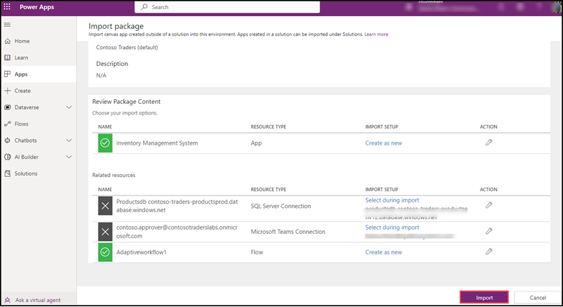

<h2>Setup Instructions for Power Platform App- Inventory Management System</h2>

This deployment guide is designed to deploy a Power app into your Power platform environment. Inventory Management App can be used for updating the product details in a fully automated way. This app created by using workflows and Adaptive card. You can export and import canvas apps by using packages. This feature allows you to export an app from one environment and import it to another. Export and import packages have the file format .zip. Here you are going to import a Canvas App named Inventory Management System into your Power platform environment and will execute some update operations.

<h3>Pre-Requisite</h3>

<h4>Azure Portal</h4>

   In Azure portal you are going to add a user with licenses PowerApps, Power Automate. Please follow below steps.
  
   1. Login into Azure Portal and go to Azure Active directory.
      
   
      
    2. Select User on the Azure Active Directory.
   
   
   
   3. Click on +New user to add a new user and select create new user.
   
   
   
   4. You will navigate to New user page. Enter the user name, Name and password you an choose. After that scroll down and under Groups select a group (its not mandatory) and Roles section keep user as it is, you may add other details like usage location, job Info. After that click Create.
    
   5. Once the user added, please click on the user name which you created just now from the Active Directory Users Page.
   6. Click on Assigned Roles.
   
   
   
   7. Select +Add Assignments, a side screen will open with Display Roles, search power platform administrator and select the Power platform administrator role from the list and click Add.

  

Now the user is ready to access the power platform

<h4>Power platform environment</h4>
  
  1. Login into power platform environment with the same user account you have created by clicking on the below link:
      https://powerapps.microsoft.com/en-us/ 
     If its ask for Location and contact information please enter the detials and click submit.
     
     
      
  
  3.  Add a business user in sharepoint list. For user details refer cloudlabs instructions.
   
    1. Create a new Team Site
    2. Create a Sharepoint list with columns Title(defaukt column), Password(Single Line Text Type)
  
   **Note: This user is going authenticate the Inventory Management Application.** 
  
  4. A sharepoint list to be created named Update Product details.

      1. Create a new Sharepoint Teamsite
      2. Create a Sharepoint list having columns Title (default column), Id(Number Type), Name(Single Line Text type), ImageName(Single Line Text Type), Price(Number with 3 decimal places)
      
      4. Add the connection in your Dataverse
        1. Go to Powerplatform admin center
        2. Click down arrow of Dataverse, then select Connections, then click on +New connection.
        3. From the list of new connection select Sharepoint and Select Connect directly (cloud services) and click Create.
         
   Your sharepoint list connection is available in your Dataverse.   
  
   **Note: This list will store the details of the Product update, the business entered through the inventory app.**
  
  5. Create an Azure SQL database connection string in the dataverse section of the power platform environment and validate it.
  
    1. Go to Powerplatform admin center
    2. Click down arrow of Dataverse, then select Connections, then click on +New connection.
    3. From the list of connections select SQL Server.
    4. On the Authentication type select SQL Server Authentication.
    5. Provide the SQL Server Name. (You can copy the server name from the azure portal where you deployed the web app)
       1. You can go to SQL Databases in Azure Portal
       2. Select productsdb database fromt the list.
       3. In the over view section you can see the server name on the top right corner.
    6. Add database name productsdb
    7. Add Username localadmin
    8. Add password (you have created SQL_PASSWORD in github secrets for the execution of workflows), then click Create.
    
    Now you have a dataverse connection of your Azure SQL Database.
    
**Deployment**

Before deploying in github go to docs folder, then click on PowerApp folder, you can see a zip file named InventoryManagementSystemApp_20221201093604.zip. Please download this file. It is an Export Package file of Inventory Management System Canvas App.

  1. After login into the Power platform environment go to Power platform admin center and click on Apps and then click on Import Canvas App.
  
  
  
  3. Power PLatform is importing the Inventory Management App. It will take hardly 2-3 minutes.
  
  
  
  5. After completing the Import Canvas App, you will reach into import package details pane. Go through the details.

   
   
   

   
  5. On the Import Package Pane under Related resources please select sql server connection. A side screen will open with a SQL server database connectivity which you already created in the dataverse. Please click Save.
   
   

  7. Go to the Related resources select Microsoft Teams Connection. A side screen will open with a MIcrosoft Teams user connection whiich you already configured in the dataverse. Please click Save.
   
   

8. You can see now all the connections are validated and Import button is enabled. Please click Import.

  

  7. and validate the connection strings. While importing the application user need to validate the workflow as created new and connection string with Azure SQL database as update. Then click on the import button.
  8. It will take 5-10 minutes to complete the import operation and once it completed user can access the Inventory Management System App.
  9. CLick on the App to execute it, enter the business user credentials on it and go to update product screen and do an update of the price of any product. 
    
    
**Common errors**
  
  1. Authentication failed
  2. Connection string not listed
    
**to resolve the above errors you can choose following options**    
    
  1. Check the user connection string is available.
    
  2. If the Azure SQL database connection string not validated please create a connection string in dataverse section of the power platform.
