<h1>Deployment Guide -  Inventory Management System with Microsoft Power Platform</h1>

This deployment guide is designed to help you deploy the Inventory Management System for Contoso Traders, built using Microsoft Power Platform. Inventory Management Systems is an internal application designed to manage product catalogue, stock, price etc for products listed on Contoso Traders. 

 Microsoft Power Platform features, including Power Apps & Power Autoamte is used for developing and hosting this application, using Power Platforn's low-code/no-code approach towards application development. 

 Microsoft Power Apps is a low-code platform that allows users to easily create custom business applications for various scenarios. Power Automate is a tool that enables users to automate business processes and workflows. Together, these tools can be used to streamline and improve various business operations, such as data entry, data management, and communication between different business systems. 
 
 In Contoso Traders, we are usinge Power Apps to create a custom app for tracking and updating products inventory and Power Automate to automatically send notifications, approval workflow for change and update the products catalogue database once changes are approved. Power Automate integrates with Microsoft Teams for notifications and approval process. 

You will be using a pre-created Package to import the Power App & Power Automate configuration in your environment. 

<h2>Pre-Requisite</h2>
You will need the following before we start the deploymment

1. You need to have ContosoTraders App deployed in your Azure Subscription. If you have not deployed it yet, please refer the [documentation](../docs/App-Deployment-Guide.md).

2. An account with global administrator rights on the M365 tenant. 

3. 3 Microsoft 365 license with ability to use SharePoint lists. If you dont have please, please add a license of Microsoft 365 before you begin click [here](https://learn.microsoft.com/en-us/microsoft-365/commerce/licenses/buy-licenses?view=o365-worldwide).

4. Optionally, 3 Microsoft Teams Exploratory, Power Apps for Microsoft 365 and Power Automate for Microsoft 365 licenses if not included in your M365 license already. If you dont have please add a license of Microsoft Teams exploratory before you begin click [here](https://learn.microsoft.com/en-us/microsoftteams/teams-exploratory).

 
<h2>Prepare for Deployment</h2>

<h3>Prepairing your user accounts</h3>

For the purpose of demonstration, you should have following users in your M365 tenant, licensed with M365 licenses specified in pre-requisites. 

1. Inventory Management Executive, who will be using the PowerApp to create/update the products inventory. 

2. Inventory Managerm, who will reviewing the inventory and approve changes. 

You can create new user accounts or use existing accounts. Please follow [this documentation](https://learn.microsoft.com/en-us/microsoft-365/admin/add-users/add-users?view=o365-worldwide). to learn more about creating users and assigning licenses. 

<h3>Create a SharePoint List</h3>

Microsoft SharePoint is a web-based collaboration and document management platform. One of the key features of SharePoint is the ability to create and manage lists of data. 

In Power Apps, SharePoint lists can be easily integrated and used as a data source for creating custom business applications. This allows users to access and manage their SharePoint data within the context of a custom app, making it easier to work with and analyze that data. 

Contoso Traders leverages SharePoint list to store the data used by Inventory Management Power App, such as product price.

Let's create a SharePoint list. 

1. Go to office.com, and sign in to your Global Administrator account. 

2. In the upper left corner of the window, select the app launcher  App Launcher > All apps > SharePoint  

3. Select + Create site on the SharePoint start page.

  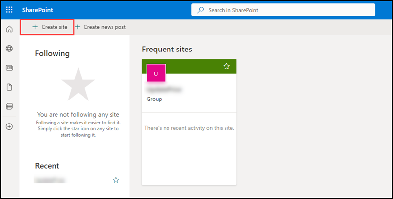

4. Select Teamsite.

  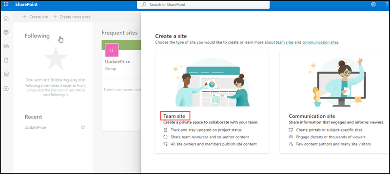
  
5. Enter the Site name, from the privacy settings dropdown list please select public- anyone can access this site and click Next.

  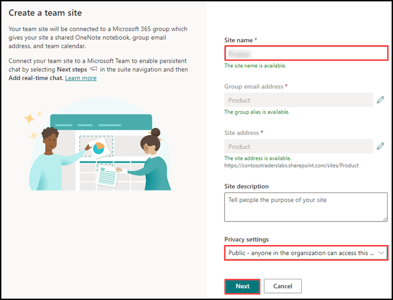
  
6. Please click finish, no need of adding members there.

  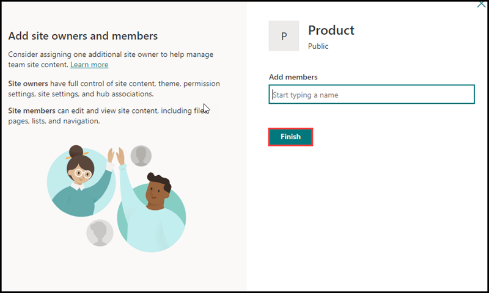

7. Click on New > List

  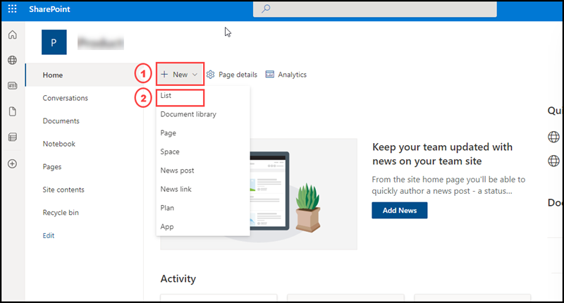

8. Create a SharePoint list with following columns. 
      1. Title (default column)
      2. Id(Number Type) 
      3. Name(Single Line Text type)
      4. ImageName(Single Line Text Type)
      5. Price(Number with 3 decimal places)

<h3>Prepare your Power Platform Environment</h3>
  
1. Login into power platform environment by clicking on this [link](https://powerapps.microsoft.com/en-us/) with your Global Administrator account.
      
   If it asks for Location and contact information please enter the details and click submit.
     
  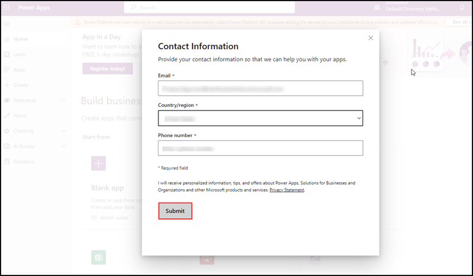
      
    
3. Add the connection to SharePoint list in your Dataverse
   1. Go to the Power platform admin center
   2. Click the down arrow right to the Dataverse 
   3. Select Connections and  click on +New connection.
   
   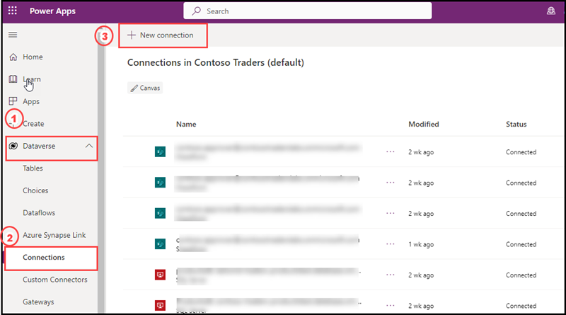
   
   4. From the list of new connections, select Sharepoint and Select Connect directly (cloud services) and click Create.
    
   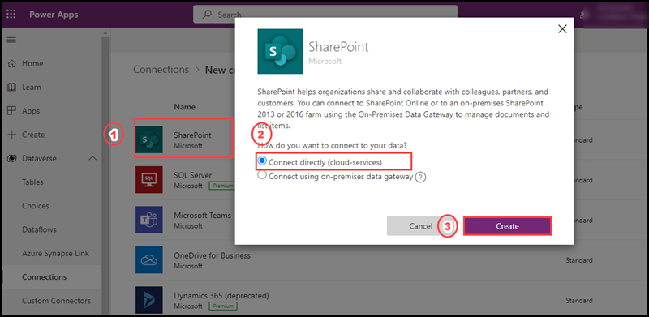
    
   Your sharepoint list connection is now available in your Dataverse.   
    
  
4. Create an Azure SQL database connection in in the dataverse
   1. Go to the Power platform admin center
   2. Click the down arrow right to the Dataverse 
   2. Select Connections, then click on +New connection.
   
   
   
   4. From the list of connections select SQL Server.
   5. On the Authentication type select SQL Server Authentication.
   
   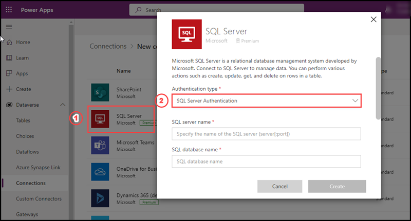
   
   7. Please provide the SQL Server Name. (You can get the server name from the azure portal where you have deployed the Contoso Trader. It'd start with "productsdb...."
      
   6. Add database name productsdb
   7. Add Username localadmin
   8. Add SQL Password.  (You created a new SQL_PASSWORD in GitHub secrets while deploying the Contoso Traders Application)
   
    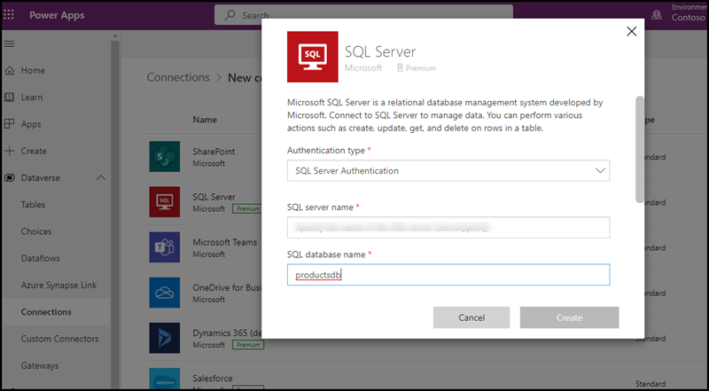

   9. Review all details and Click Create

    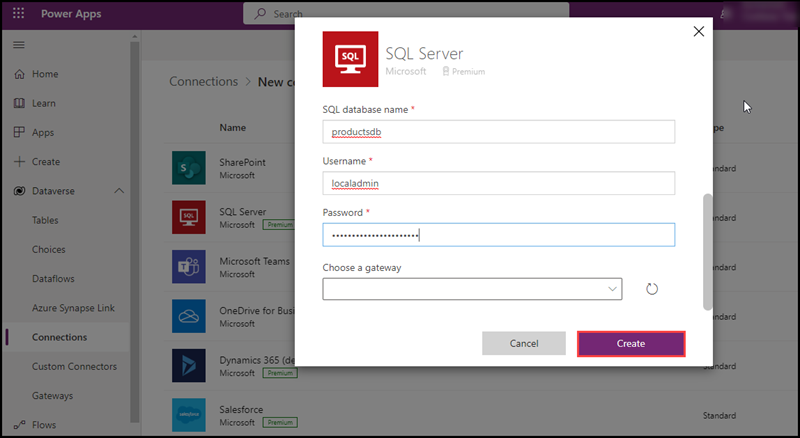
    
Your Azure SQL Connection is now available in Dataverse. 

<h2>Deployment of Inventory Management System App</h2>

   Now, we will need to import the Power App package to setup the Power Apps & Power Automate. Please download the zip file named InventoryManagementApp.zip [here](../src/ContosoTraders.Api.Inventory/InventoryManagementApp.zip)
   

1. Login to [Power Platform Admin Center](https://admin.powerplatform.microsoft.com/) with your Global Administrator account. 

2. Navigate to Apps and then click on Import Canvas App. Select the recently downloaded zip file. 
  
 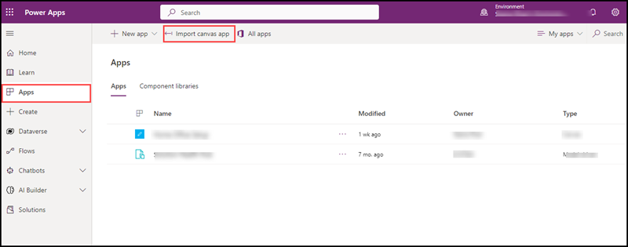
  
2. Power Platform is importing the Inventory Management App. It will take about 2-3 minutes.
  
 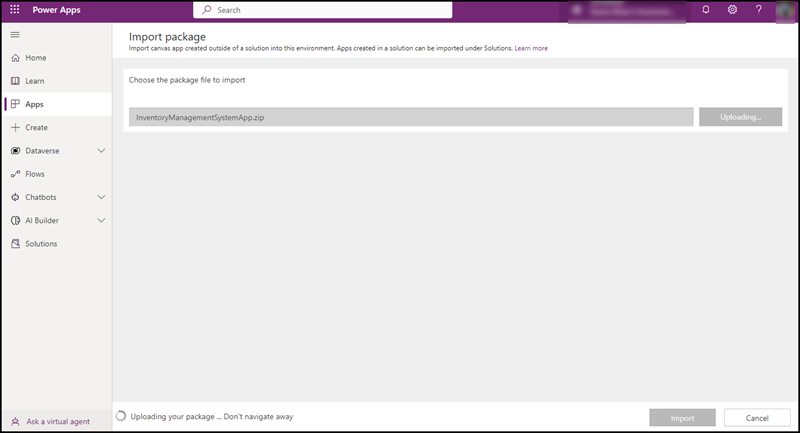
  
3. After completing the Import Canvas App, you will get to import package details pane. Take a moment to look at the details.

 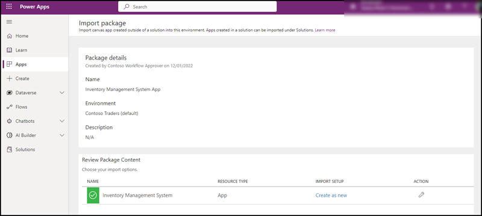
   
 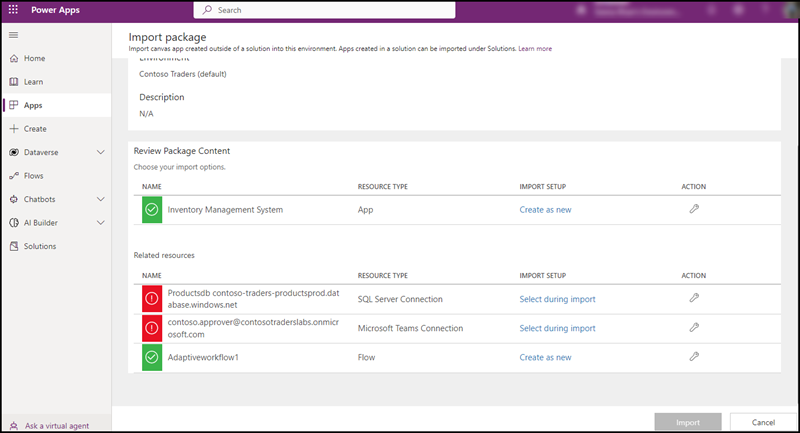

   
4. Go to Review Package Content section and select Inventory Management App. A side screen will open please select create new and click Save.
 
 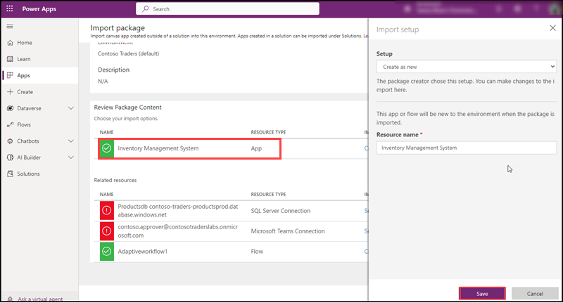

5. Please select sql server connection. A side screen will open with a SQL server database connectivity which you already created in the dataverse. Please click Save.
   
 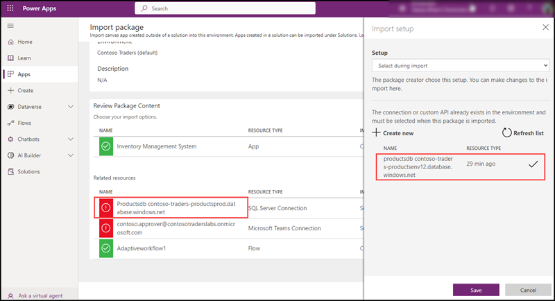

6. Go to the Related resources select Microsoft Teams Connection. A side screen will open with a Microsoft Teams user connection which you already configured in the dataverse. Please click Save.
   
 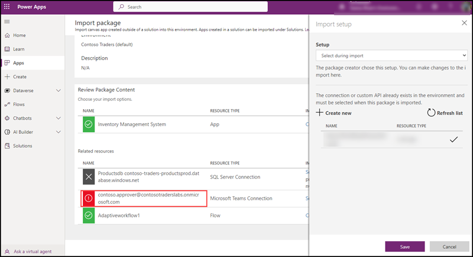
   
7. Go to the Related Resources Select Workflow. A side screen will open please select create new and click Save.

 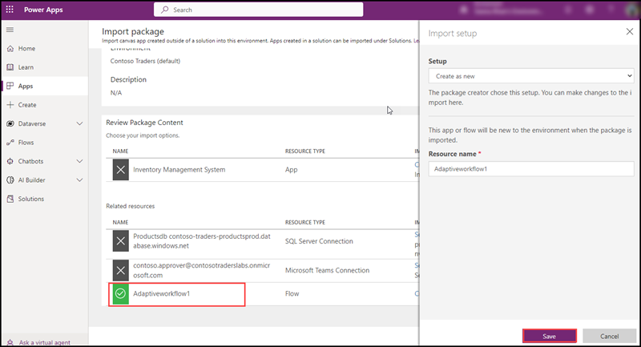

8. You can see now all the connections are validated and Import button is enabled. Please click Import.

 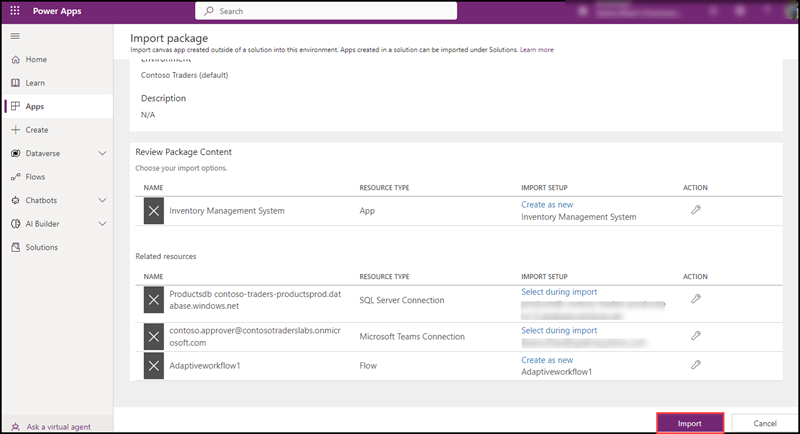

9. It wiil take 2-3 minutes to complete the Import process. After completing the Import you will see a message showing that all package rsources were successfully imported.

 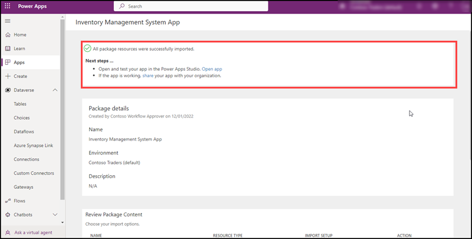
   
10. Please click on the open App link from the successful message.
  
 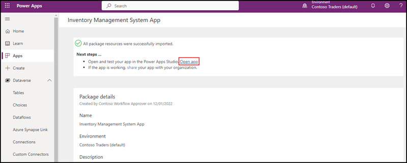
  
11. You will get Allow box to allow validated connections you have validated at the time of import process. Please click allow

 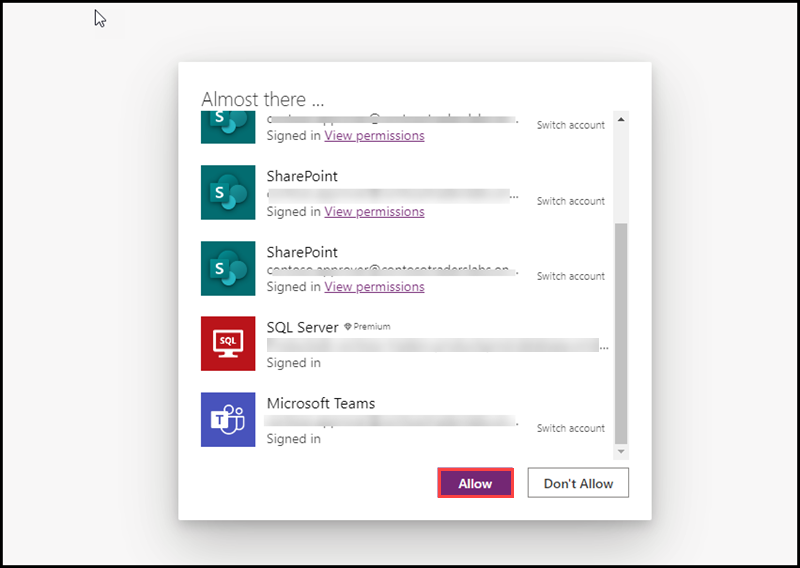
  
12. Go to Power Platform admin center, select Apps and you can see the imported Inventory Management System Canvas App is now available.
   
 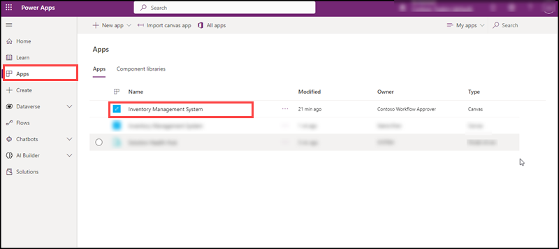
 
 You have successfully imported the Inventory Management System App.
 
 <h2>Testing the App</h2>
   
 To execute the Inventory Management System App 
 
  1. Go to Power Platform Admin center and select Apps.

  2. Click on Inventory Management app to start the applicaiton. 

  3. You should now be able to use the app and make changes to your products catalogue. 

 
  For further proceedings please check out the [overview](../demo-scripts/low-code-development/overview.md) this [technical walkthrogh](../demo-scripts/low-code-development/technical-walkthrough.md) to try out the application end to end and review the deployment. 
 
     
<h2>Common errors</h2>
  
1. Authentication failed
  
   Validate the users and licenses pre-requisites are met. 

2. Connection string not listed
   
   Create the connection string in the Dataverse section of the Power Platform admin center.
     
3. Error on connecting the Azure SQL database.
  
   Check the password given for the SQL database is taken from the github secrets SQL_PASSWORD configuration.
          
<h2>Questions & Support</h2>
	
This project is community supported. Please raise issue via GitHub incase of issues/questions. 

<h3>Clean Up</h3>

Once you are done deploying, testing, exploring, you can delete the provisioned Inventory Management App from the Power Platform Admin Center.   
