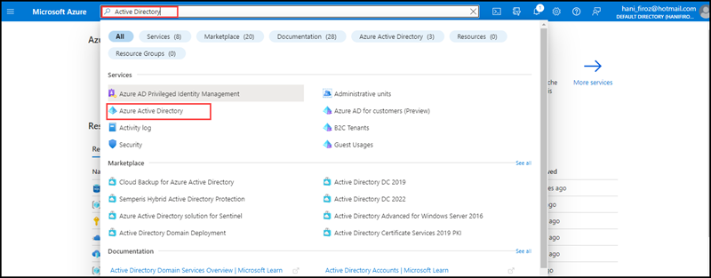
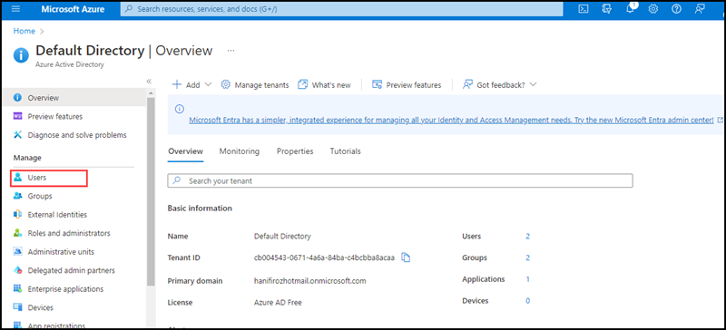
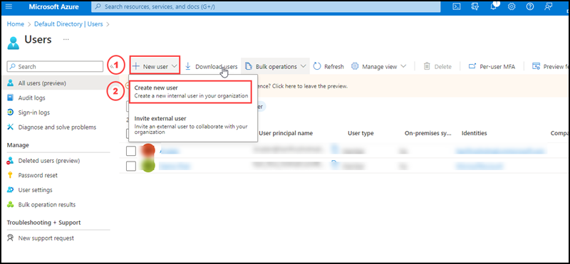
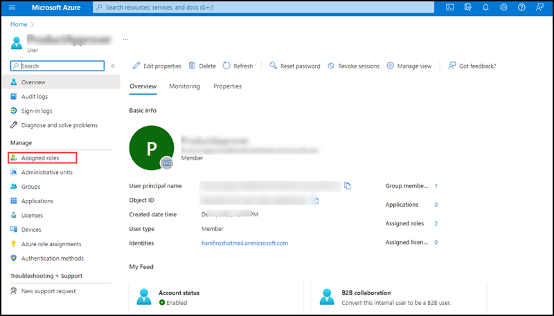
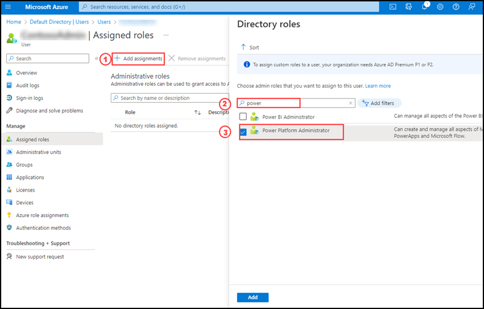

<h1>Setup Instructions for Power Platform App- Inventory Management System</h1>

This deployment guide is designed to deploy a Power app into your Power platform environment. Inventory Management App can be used for updating the product details in a fully automated way. This app created by using workflows and Adaptive card. You can export and import canvas apps by using packages. This feature allows you to export an app from one environment and import it to another. Export and import packages have the file format .zip. Here you are going to import a Canvas App named Inventory Management System into your Power platform environment and will execute some update operations.

<h3>Pre-Requisite</h3>
You will the following before we start the deploymment

1. Two users need to be created and one user having Global administrator role.

3. Create Sharepoint list to store the Product update details.

5. Add dataverse connections for Sharepoint list and Azure SQLDatabase.

<h2>Prepairing your user accounts in Azure Portal</h2>

In Azure portal you are going to add a user with licenses PowerApps, Power Automate. Please follow below steps.
  
1. Login into Azure Portal and go to Azure Active directory.
      
  
      
2. Select User on the Azure Active Directory.
   
  
   
3. Click on +New user to add a new user and select create new user.
   
  
   
4. You will navigate to New user page. Enter the user name, Name and password you can choose. After that scroll down and under Groups select a group (its not mandatory) and Roles section keep user as it is, you may add other details like usage location, job Info. After that click Create.
    
5. Once the user added, please click on the user name which you created just now from the Active Directory Users Page.

7. Click on Assigned Roles.
   
  
   
8. Select +Add Assignments, a side screen will open with Display Roles, search power platform administrator and select the Power platform administrator role from the list and click Add.

  

9. Add a global administrator role to the user by using above steps. Now the user is ready to access the power platform

10. Add another user into the Active directory. 

11. Login into Microsoft 365 with global administrator user account and add the license of Microsoft 365. To add the license please check the [link](https://learn.microsoft.com/en-us/microsoft-365/commerce/licenses/buy-licenses?view=o365-worldwide).

12. Add Microsoft Teams exploratory license to the another user. To add the license please check this [link](https://learn.microsoft.com/en-us/microsoftteams/teams-exploratory).

<h2>Configuring Power platform environment</h2>
  
1. Login into power platform environment by clicking on this [link](https://powerapps.microsoft.com/en-us/) with the same user account you have created.
      
   If it ask for Location and contact information please enter the detials and click submit.
     
  
      
2. Add a sharepoint list     
  
   1. Create a Team Site
   2. Create a Sharepoint list having columns Title (default column), Id(Number Type), Name(Single Line Text type), ImageName(Single Line Text Type), Price(Number with 3 decimal places)
      
3. Add the connection in your Dataverse
   1. Go to Powerplatform admin center
   2. Click down arrow of Dataverse, then select Connections, then click on +New connection.
   3. From the list of new connection select Sharepoint and Select Connect directly (cloud services) and click Create.
         
   Your sharepoint list connection is available in your Dataverse.   
  
   **Note: This list will store the details of the Product update, the business entered through the inventory app.**
  
4. Create an Azure SQL database connection string in the dataverse section of the power platform environment and validate it.
  
   1. Go to Powerplatform admin center
   2. Click down arrow of Dataverse, then select Connections, then click on +New connection.
   3. From the list of connections select SQL Server.
   4. On the Authentication type select SQL Server Authentication.
   5. Provide the SQL Server Name. (You can copy the server name from the azure portal where you deployed the web app)
   
      1. You can go to SQL Databases in Azure Portal
      2. Select productsdb database fromt the list.
      3. In the over view section you can see the server name on the top right corner.
      
   6. Add database name productsdb
   7. Add Username localadmin
   8. Add password (you have created SQL_PASSWORD in github secrets for the execution of workflows), then click Create.
    
    Now you have a dataverse connection of your Azure SQL Database.
    
<h2>Deployment of Inventory Management System App</h2>

   Before deploying, in github go to docs folder, then click on PowerApp folder, you can see a zip file named InventoryManagementApp.zip. Please download this file. It  is an Export Package file of Inventory Management System Canvas App. You are going to import this zip file into your power platform environment.

1. After login into the Power platform environment go to Power platform admin center and click on Apps and then click on Import Canvas App.
  
 
  
2. Power PLatform is importing the Inventory Management App. It will take hardly 2-3 minutes.
  
 
  
3. After completing the Import Canvas App, you will reach into import package details pane. Go through the details.

 
   
 

   
4. Go to Review Package COntent section and select Inventory Management App. A side screen will open please select creat new and click Save.
 
 

5. Please select sql server connection. A side screen will open with a SQL server database connectivity which you already created in the dataverse. Please click Save.
   
 

6. Go to the Related resources select Microsoft Teams Connection. A side screen will open with a MIcrosoft Teams user connection whiich you already configured in the dataverse. Please click Save.
   
 
   
7. Go to the Related Resources Select Workflow. A side screen will open please select creat new and click Save.

 

8. You can see now all the connections are validated and Import button is enabled. Please click Import.

 

9. It wiil take 2-3 minutes to complete the Import process. After completing the Import you can see a message shows all package rsources were successfully imported.

 
   
10. Please click on the OPen App link from the successful message.
  
 
  
11. You will get Allow box to allow validated connections you have validated at the time of import process. Please click allow

 
  
12. Go to PowerPlatform admin center, select Apps and you can see the imported Inventory Management System Canvas App is there.
   
 
 
 You have successfully imported the Inventory Management System App.
 
 <h2>Testing the App</h2>
   
 To execute the Inventory Management System App 
 
  1. Go to Power Platform Admin center and select Apps.
  2. You can see the imported Power App there and click on it to run it.
 
  For further proceedings please click this [link](https://github.com/microsoft/ContosoTraders/blob/main/demo-scripts/low-code-development/overview.md) to open the "LOW CODE DEVELOPMENT – HIGH LEVEL SCENARIO WALKTHROUGH" guide. You can use this guide to test the app.
 
     
<h3>Common errors</h3>
  
1. Authentication failed
  
  **Check the users having proper permissions assigned.** 
     
2. Connection string not listed
   
 **Create the connection string in the Dataverse section of the Power PLatform admin center.**
     
3. Error on connecting the Azure SQL database.
  
  **Check the password given for the SQL database is taken from the github secrets SQL_PASSWORD configuration.**
          
<h3>Clean Up</h3>

Once you are done deploying, testing, exploring, you can delete the provisioned Inventory Management App from the Power Platform Admin Center.   

